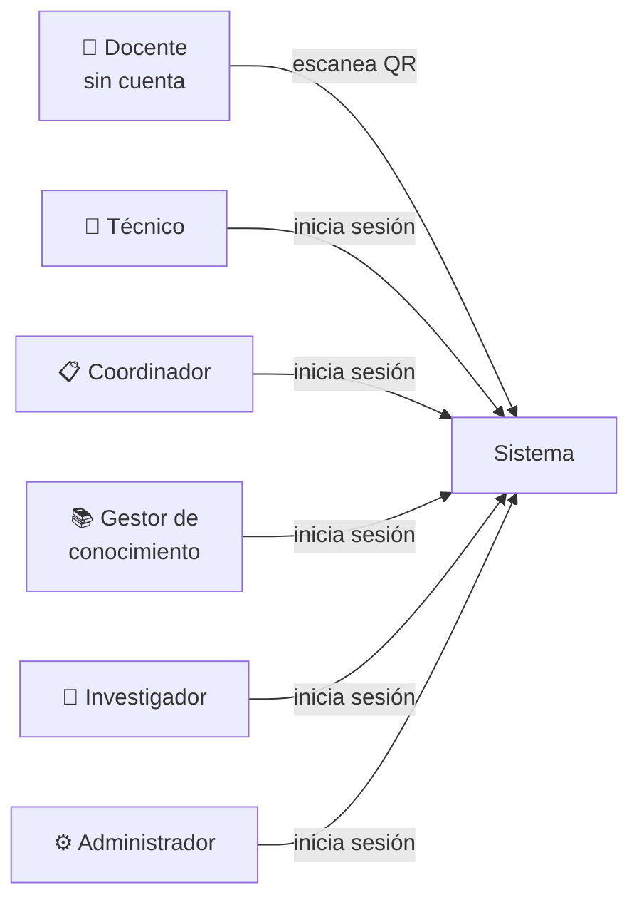
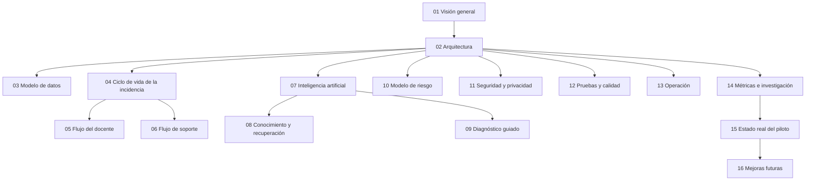

# 01 · Visión general del sistema

> **Qué encuentras aquí:** qué problema resuelve el software, para quién, qué hace
> y qué deliberadamente no hace. Es el documento que hay que leer primero.

---

## 1.1 El problema

En un aula universitaria, cuando falla el proyector, la computadora o el sonido, el
docente tiene una clase esperando y un procedimiento poco claro por delante. En la
práctica ocurre casi siempre lo mismo:

1. El docente intenta arreglarlo solo, sin saber por dónde empezar.
2. Si no lo consigue, llama o escribe a alguien de soporte por un canal informal
   (teléfono personal, WhatsApp, buscar a alguien por el pasillo).
3. Soporte llega sin saber qué equipo es, qué se intentó ya, ni qué debe llevar.
4. Cuando se resuelve, nadie registra qué se hizo. La próxima vez se empieza de cero.

Ese proceso tiene cuatro costes medibles: **minutos de clase perdidos**, **desplazamientos
evitables** de personal técnico, **conocimiento que no se acumula**, y **ausencia total de
datos** para decidir qué equipos hay que cambiar o qué aulas necesitan atención.

## 1.2 Qué hace el sistema

El sistema convierte ese proceso informal en un canal único, medido y asistido:

| Etapa | Antes | Con el sistema |
|---|---|---|
| Avisar | Llamada o WhatsApp a un número personal | Escanear un QR pegado en el aula |
| Identificar el aula | El docente lo dice de memoria | Cascada guiada: pabellón → piso → aula |
| Describir el problema | Texto libre por chat | Texto libre que la IA clasifica, o botones |
| Intentar resolverlo | Improvisación | Diagnóstico guiado paso a paso, con fotos del equipo real |
| Escalar | Insistir por el mismo canal | Un botón; el ticket llega al panel con todo el contexto |
| Registrar la solución | No se registra | Obligatorio al cerrar; alimenta la base de conocimiento |
| Decidir con datos | Imposible | Reportes por aula, pabellón, equipo y periodo |

## 1.3 Los tres objetivos

1. **Reducir el tiempo de interrupción de clase.** Que el docente resuelva solo lo que
   se puede resolver solo, y que cuando no se pueda, soporte llegue informado.
2. **Convertir el soporte reactivo en trazable.** Cada incidencia deja un registro
   completo: quién, cuándo, qué se intentó, qué lo resolvió.
3. **Producir datos para decidir.** Qué falla, dónde, cada cuánto, y qué señales
   anticipan un fallo.

## 1.4 Quiénes usan el sistema

| Actor | Se autentica | Qué hace |
|---|---|---|
| **Docente** | **No** | Reporta, sigue el diagnóstico, pregunta al asistente, consulta el estado de su solicitud |
| **Técnico** | Sí | Toma tickets, los atiende, registra qué hizo |
| **Coordinador** | Sí | Asigna trabajo, ve el tablero y los reportes, cancela |
| **Gestor de conocimiento** | Sí | Carga documentos, define procedimientos, administra imágenes |
| **Investigador** | Sí | Solo lectura + exportación del conjunto de datos |
| **Administrador** | Sí | Todo, incluida la gestión de usuarios |

La ausencia de autenticación para el docente es la decisión más importante del diseño
y está justificada en [02 · Arquitectura](02-arquitectura.md#26-decisiones-de-diseño-transversales).

## 1.5 Alcance del piloto

| Dimensión | Alcance |
|---|---|
| Sede | Huancayo, únicamente |
| Pabellones | C, D, E, G, H, I, J (siete) |
| Pisos por pabellón | Cinco |
| Aulas por piso | Tres a cuatro |
| Tipo de incidencia | Tecnológica de aula (proyección, audio, cómputo, red) |
| Modalidad de acceso | Un único QR genérico para toda la sede |

> **Estado:** esa estructura está hoy cargada como aproximación de prueba. Los códigos
> reales de aula todavía no se han incorporado. Ver
> [15 · Estado real del piloto](15-estado-real-del-piloto.md).

## 1.6 Qué NO hace el sistema, y por qué

Declarar los límites es parte del diseño. Cada exclusión tiene un motivo:

| No hace | Por qué |
|---|---|
| **No gestiona incidencias no tecnológicas** (limpieza, mobiliario, infraestructura) | Cada dominio tiene su propio flujo de resolución y su propio equipo. Mezclarlos diluye el indicador central. |
| **No sustituye la mesa de ayuda institucional** | Es un canal para el aula, medido, no un reemplazo del sistema corporativo. |
| **No controla equipos de forma remota** | Requeriría acceso administrativo a la red de la universidad, fuera del alcance de un trabajo de investigación. |
| **No identifica al docente** | Pedir identificación reintroduce la fricción que el sistema existe para eliminar. Ver [11 · Seguridad](11-seguridad-y-privacidad.md). |
| **No envía notificaciones a teléfonos** | Exigiría un servicio externo de pago y datos personales de contacto. El aviso vive en el panel. |
| **No usa servicios de IA de pago ni en la nube** | Restricción del proyecto: todo el modelo corre localmente. Ver [07 · Inteligencia artificial](07-inteligencia-artificial.md). |

## 1.7 Glosario

Términos que aparecen en toda la documentación y en el propio código.

| Término | Significado en este sistema |
|---|---|
| **Incidencia** | Un problema tecnológico reportado en un aula concreta. Sinónimo de «ticket». |
| **Borrador** *(draft)* | Una incidencia que el docente empezó pero no llegó a enviar. No cuenta como incidencia en ninguna métrica. |
| **Escalar** | Pasar de «el docente lo está intentando» a «soporte tiene que venir». |
| **Categoría** | Tipo de problema (proyector, audio, red…). Catálogo administrable. |
| **Árbol / flujo de diagnóstico** | Secuencia de pasos que el sistema le propone al docente para una categoría. |
| **Fragmento** *(chunk)* | Trozo de un documento cargado, indexado para que la IA pueda buscarlo y citarlo. |
| **Recuperación / RAG** | Buscar fragmentos relevantes antes de responder, para que la IA cite en vez de inventar. |
| **Confianza** | Número entre 0 y 1 que decide si el asistente responde o escala. |
| **Score de riesgo** | Ordenamiento de aulas por probabilidad de necesitar atención. **No es una probabilidad.** |
| **Dato de demostración** | Registro falso creado para probar el sistema. Está marcado y se puede borrar en bloque. |

## 1.8 Cómo está organizada esta documentación

