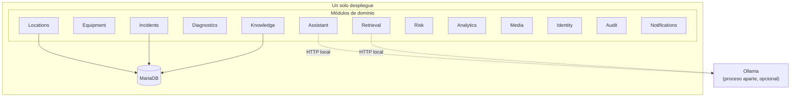
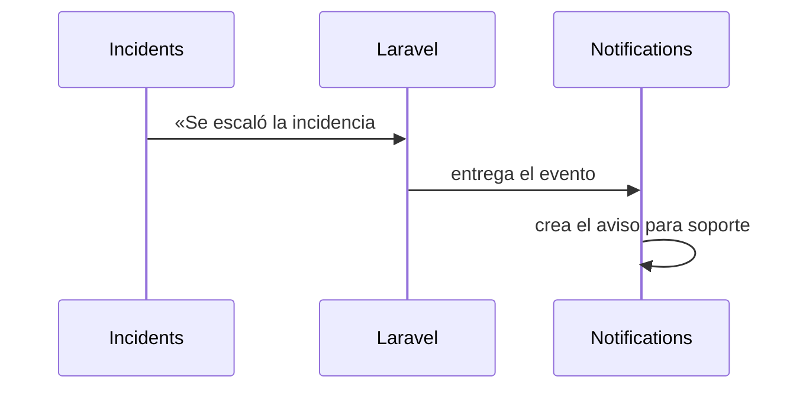
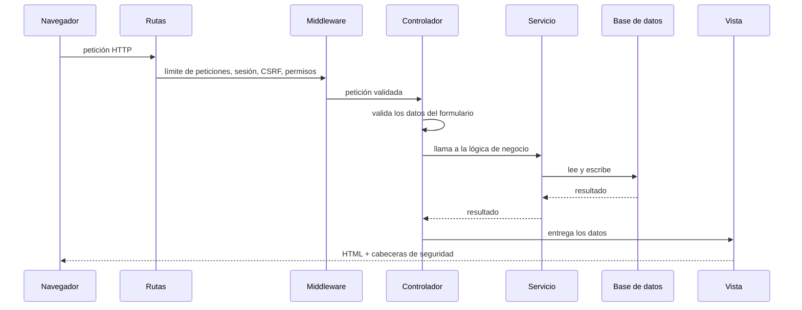

# 02 · Arquitectura del software

> **Qué encuentras aquí:** con qué está construido, por qué se eligió cada pieza, cómo
> está organizado el código y qué decisiones estructurales lo atraviesan todo.

---

## 2.1 Stack tecnológico

| Capa | Tecnología | Versión | Por qué esta y no otra |
|---|---|---|---|
| Lenguaje | PHP | 8.2 | Es lo que trae XAMPP, que es lo que hay instalado en las computadoras de la universidad. No exige permisos de administrador ni software adicional. |
| Framework | Laravel | 12 | Trae resueltos autenticación, permisos, migraciones, colas, tareas programadas y pruebas. Escribir eso a mano habría consumido el semestre. |
| Base de datos | MariaDB | 10.4 | La que incluye XAMPP. Impone una restricción real: **no tiene índice vectorial**, y eso condiciona todo el diseño de la búsqueda (ver [08](08-conocimiento-y-recuperacion.md)). |
| Interfaz | Blade + Tailwind CSS 4 | — | Renderizado en el servidor. Sin framework de JavaScript: la página tiene que abrir rápido en un celular de gama media, de pie, en un aula. |
| JavaScript | Vanilla, un solo archivo | — | Sin `onclick` en el HTML. Todo el comportamiento se engancha por atributos `data-*`. Es lo que permite una política de seguridad estricta (ver [11](11-seguridad-y-privacidad.md)). |
| Modelo de lenguaje | Ollama + Qwen 2.5 7B | — | Corre en la propia computadora. Sin costes, sin cuenta, sin datos saliendo a internet. |
| Vectores | Ollama + nomic-embed-text | 768 dim. | Mismo motivo: local. |
| Pruebas | Pest | 3.8 | 442 pruebas. Ver [12](12-pruebas-y-calidad.md). |
| Análisis estático | PHPStan | nivel 5 | Detecta errores de tipos antes de ejecutar. |
| Formato | Laravel Pint | — | Un solo estilo de código en todo el proyecto. |

### La restricción que más forma le dio al sistema

MariaDB 10.4 **no tiene un tipo de dato vectorial ni un índice de vecinos cercanos**.
En un proyecto sin restricciones se usaría PostgreSQL con `pgvector`, o un servicio
especializado. Aquí no se puede: el sistema tiene que funcionar sobre el XAMPP que ya
está instalado.

La consecuencia es que la búsqueda semántica se resuelve **prefiltrando en SQL y
calculando la similitud coseno en PHP** sobre un conjunto reducido de candidatos. Eso
funciona bien con miles de fragmentos y dejaría de funcionar con millones — un límite
que conviene declarar en lugar de disimularlo.

---

## 2.2 Estilo arquitectónico: monolito modular

El sistema **no** son microservicios y **no** es un Laravel plano con todo mezclado en
`app/Http/Controllers`. Es un **monolito modular**: un único despliegue, una única base
de datos, pero el código dividido en trece módulos de dominio con fronteras explícitas.

### Por qué modular y no plano

Un Laravel plano habría sido más rápido de escribir. Se eligió modular por tres razones
concretas:

1. **El proyecto continúa en Taller de Investigación 2.** Otra persona —o yo mismo dentro
   de seis meses— tiene que poder abrir el módulo `Risk` y entenderlo sin leer el resto.
2. **La frontera obliga a pensar.** Cuando un módulo necesita algo de otro, hay que
   decidir explícitamente si eso es una dependencia legítima. En un proyecto plano esa
   decisión no llega a tomarse nunca.
3. **Aísla la parte experimental.** Toda la IA vive en `Assistant` y `Retrieval`. Se
   puede apagar, sustituir o reescribir sin tocar el flujo de incidencias.

### Por qué no microservicios

Sería una decisión indefendible aquí: se despliega en **una** computadora, lo mantiene
**una** persona, y el tráfico es de decenas de peticiones al día. Los microservicios
resuelven problemas de escala y de organización que este proyecto no tiene, a cambio de
una complejidad operativa que sí tendría.

---

## 2.3 Los trece módulos

Todos viven en `app/Modules/`. La cifra de archivos da una idea del peso de cada uno.

| Módulo | Archivos | Responsabilidad | Depende de |
|---|---|---|---|
| **Incidents** | 27 | El corazón. Ciclo de vida del ticket, prioridad, antiabuso, detección de riesgo físico, seguimiento del docente. | Locations, Diagnostics, Notifications |
| **Locations** | 18 | Sedes, pabellones, pisos, aulas. Importación masiva, generación del QR. | — |
| **Knowledge** | 14 | Documentos, versiones, extracción de texto, fragmentación, indexación. | Retrieval, Media |
| **Assistant** | 12 | Clasificación de intención, respuesta a preguntas, evaluación de confianza, verificación de la respuesta. | Retrieval, Knowledge |
| **Diagnostics** | 9 | Árboles de diagnóstico versionados y el motor que los recorre. | Media |
| **Risk** | 9 | Cálculo de señales de riesgo por aula. | Incidents, Locations |
| **Analytics** | 8 | Tablero, reportes, historial de aula, exportación del conjunto de datos. | Incidents |
| **Retrieval** | 5 | Búsqueda híbrida y generación de vectores. | Knowledge |
| **Media** | 5 | Banco de imágenes, reprocesado, eliminación de metadatos. | — |
| **Equipment** | 4 | Inventario de equipos por aula y su mantenimiento. | Locations |
| **Identity** | 3 | Usuarios, roles y permisos. | — |
| **Notifications** | 3 | Avisos internos a soporte. | — |
| **Audit** | 2 | Registro de acciones administrativas. | — |

### Estructura interna de un módulo

Todos siguen la misma disposición, para que abrir uno cualquiera no exija reaprender
nada:

| Carpeta | Qué contiene |
|---|---|
| `Models/` | Las entidades y sus relaciones |
| `Services/` | La lógica de negocio. Es donde vive el «cómo funciona» |
| `Http/Controllers/` | Traducen una petición web a una llamada al servicio |
| `Contracts/` | Interfaces. Definen qué se espera, no cómo se hace |
| `Providers/` | Implementaciones intercambiables de un contrato |
| `Console/` | Comandos que se ejecutan por línea de comandos o por tarea programada |
| `Jobs/` | Trabajo que se hace en segundo plano |
| `Events/` y `Listeners/` | Comunicación entre módulos sin acoplarlos |

---

## 2.4 Cómo se comunican los módulos

Hay tres formas, en orden de acoplamiento creciente:

### a) Eventos (el más desacoplado)

Cuando una incidencia se escala, el módulo `Incidents` **anuncia** el hecho. No sabe
quién escucha. `Notifications` escucha y avisa a soporte.

Ventaja: si mañana hay que avisar también por otro canal, se añade otro oyente sin
tocar `Incidents`.

### b) Contratos e inyección de dependencias

`Assistant` no conoce a Ollama. Conoce una interfaz llamada `LlmProvider`. Laravel decide
en tiempo de ejecución cuál de las tres implementaciones entregar:

| Implementación | Cuándo se usa | Qué hace |
|---|---|---|
| `OllamaProvider` | Producción y desarrollo con IA | Habla con el modelo local |
| `NullLlmProvider` | Cuando no hay IA disponible | Dice honestamente que no puede |
| `FakeLlmProvider` | En las pruebas | Responde de forma predecible |

Esto es lo que permite que **las 442 pruebas se ejecuten sin necesidad de tener Ollama
instalado**, y que el sistema funcione completo con la IA apagada.

### c) Llamada directa a un servicio

Cuando la dependencia es real y permanente (por ejemplo, `Incidents` necesita saber en
qué aula ocurre algo), se llama directamente. No se inventa una capa de indirección
para una relación que no va a cambiar.

---

## 2.5 Recorrido de una petición

Qué ocurre, en orden, desde que el docente pulsa un botón:

**La regla que se respeta en todo el proyecto:** el controlador no contiene lógica de
negocio. Valida la entrada, llama a un servicio y devuelve una vista. Toda la decisión
está en el servicio, que es lo que se puede probar sin levantar un servidor web.

---

## 2.6 Decisiones de diseño transversales

Estas son las decisiones que atraviesan todo el sistema. Cada una tuvo alternativas
y se descartaron por un motivo concreto.

### D-1 · El docente no se autentica

**Qué se hizo:** el docente accede sin cuenta ni contraseña.

**Alternativa descartada:** pedir el correo institucional.

**Por qué:** el sistema existe para reducir la fricción de reportar. Una pantalla de
inicio de sesión delante de alguien que tiene cuarenta estudiantes esperando es
exactamente la fricción que hace que la gente llame por WhatsApp. Añadir autenticación
habría garantizado que el canal medido no se use, y sin uso no hay investigación.

**Lo que cuesta:** no se sabe quién reportó. Se acepta y se compensa con los controles
antiabuso descritos en [11](11-seguridad-y-privacidad.md).

### D-2 · Un solo QR genérico para toda la sede

**Qué se hizo:** el mismo código QR en todas las aulas; el docente elige dónde está.

**Alternativa descartada:** un QR distinto por aula.

**Por qué:** un QR por aula significa imprimir y pegar ciento veintiún carteles
distintos, y que cualquier error de pegado produzca tickets con el aula equivocada
—un dato falso que contamina toda la investigación—. El QR genérico añade tres toques
de pantalla y elimina esa clase entera de error.

**Lo que cuesta:** fricción de acceso. Se mide explícitamente: cuántos entran y no
llegan a reportar. Si sale alto, es un hallazgo legítimo y se reporta.

### D-3 · La IA nunca decide el camino del diagnóstico

**Qué se hizo:** el árbol de diagnóstico es determinista. El modelo solo clasifica el
texto de entrada, reformula el texto de un paso y sugiere una imagen.

**Alternativa descartada:** que el modelo genere los pasos.

**Por qué:** dos motivos, uno de seguridad y uno de método. De seguridad: un modelo
puede inventar un paso que dañe el equipo. De método: si cada docente recibe un
procedimiento distinto, el resultado del piloto no se puede atribuir a la intervención,
porque no hay intervención — hay ciento veintiuna intervenciones distintas.

### D-4 · El sistema funciona completo con la IA apagada

**Qué se hizo:** con el proveedor de IA en `null`, todo el sistema sigue operativo. La
clasificación cae a palabras clave; el diagnóstico funciona igual; el asistente dice que
no puede responder.

**Por qué:** Ollama es un proceso aparte que puede no estar arrancado. Si el sistema
dependiera de él, un docente con el aula esperando se encontraría una pantalla de error
por un motivo que no le importa. **Si esto deja de ser cierto, es un defecto**, y así
está escrito en la configuración del proyecto.

### D-5 · Los catálogos son datos, no código

**Qué se hizo:** categorías, estados y prioridades viven en tablas administrables.

**Por qué:** la lista de tipos de problema va a cambiar en cuanto empiece el piloto real.
Si estuviera en el código, cada cambio exigiría un programador.

**El matiz importante:** los **códigos** de estado sí están en el código, como
enumeraciones. La máquina de estados no es configuración operativa: si alguien pudiera
añadir un estado desde el panel, ninguna transición estaría garantizada. Se administra
el nombre visible, no el comportamiento.

### D-6 · Nada se borra: se versiona o se archiva

**Qué se hizo:** los documentos se versionan, los árboles de diagnóstico se versionan,
los documentos se archivan en vez de eliminarse.

**Por qué:** una incidencia atendida en marzo con la versión 1 de un procedimiento tiene
que seguir siendo interpretable contra esa versión, no contra la versión 3 de agosto.
Borrar el procedimiento antiguo deja las incidencias pasadas sin explicación posible.

### D-7 · Los datos de demostración están marcados

**Qué se hizo:** cada registro falso lleva una marca `is_demo`, y hay un comando que los
borra todos.

**Por qué:** es la diferencia entre un sistema de investigación y uno que miente. Ningún
número presentado en la tesis puede provenir de datos inventados, y la única forma de
garantizarlo es que el propio sistema sepa cuáles son.

### D-8 · La prioridad la calcula el sistema, no el docente

Ver [04 · Ciclo de vida](04-ciclo-de-vida-de-la-incidencia.md#44-cálculo-de-la-prioridad).
En resumen: si el docente eligiera, todo llegaría marcado como urgente y el campo
dejaría de ordenar el trabajo.

### D-9 · El aviso de incidencias nuevas es por consulta periódica, no por WebSocket

**Qué se hizo:** el panel consulta cada 20 segundos si hay incidencias nuevas.

**Alternativa descartada:** WebSockets.

**Por qué:** WebSockets exige un proceso servidor permanente y un servicio de mensajería.
Sobre XAMPP en una computadora de la universidad, eso es infraestructura que nadie va a
mantener. Veinte segundos de retraso es irrelevante para un problema que se resuelve en
minutos.

### D-10 · Las direcciones IP se guardan cifradas

Ver [11 · Seguridad y privacidad](11-seguridad-y-privacidad.md#115-datos-personales).

### D-11 · El docente puede consultar su solicitud sin cuenta

**Qué se hizo:** con el identificador único del ticket, sin contraseña.

**Por qué:** cerrar el circuito. Sin esto, el docente envía la solicitud y no vuelve a
saber nada, que es exactamente la experiencia del canal informal que se quiere sustituir.

**Lo que deliberadamente NO muestra:** el nombre del técnico asignado. Mostrarlo invita
a contactarlo directamente y a saltarse el canal que se está midiendo.

### D-12 · La foto es opcional

**Qué se hizo:** el docente puede adjuntar una foto desde la cámara, pero no es
obligatoria.

**Por qué:** ayuda mucho al técnico a saber qué llevar. Pero un docente con la clase
esperando no puede quedar bloqueado porque la cámara no abre.

---

## 2.7 Dónde está cada cosa

| Carpeta | Contenido |
|---|---|
| `app/Modules/` | Los trece módulos de dominio |
| `app/Shared/` | Enumeraciones compartidas (estados, prioridades, motivos de rechazo) |
| `app/Http/Middleware/` | Cabeceras de seguridad |
| `config/incidencias.php` | **Toda la configuración del comportamiento del sistema** |
| `database/migrations/` | La definición de cada tabla, en orden cronológico |
| `database/seeders/` | Datos iniciales: roles, permisos, catálogos |
| `resources/views/` | Las pantallas |
| `resources/css/app.css` | El sistema de diseño completo |
| `resources/js/interactions.js` | Todo el comportamiento del navegador |
| `routes/web.php` | Las 139 rutas, agrupadas por permiso |
| `routes/console.php` | Las tareas programadas |
| `tests/` | Las 442 pruebas, en siete suites |
| `docs/` | Esta documentación y las guías de operación |

### El archivo de configuración

`config/incidencias.php` merece mención aparte: concentra **todos** los números que
gobiernan el comportamiento del sistema (umbrales del antiabuso, parámetros de la
búsqueda, bandas de riesgo, presupuesto de peso de las imágenes). Cada bloque lleva
escrito su porqué y de dónde salió el número.

Esa concentración es deliberada: permite responder «¿por qué el sistema hizo esto?»
leyendo un solo archivo, y permite recalibrar el piloto sin tocar código.
