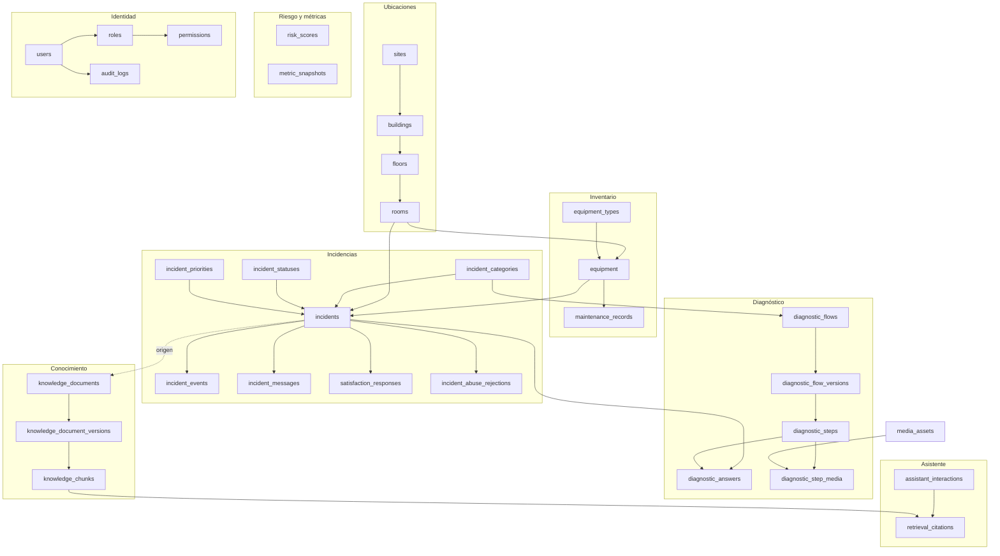
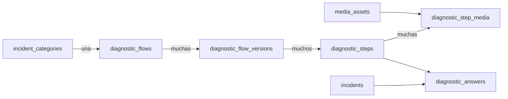
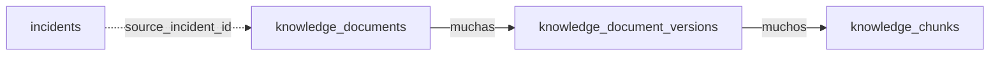

# 03 · Modelo de datos

> **Qué encuentras aquí:** las tablas del sistema, cómo se relacionan y por qué están
> diseñadas así. La base de datos tiene 44 tablas; 35 son del dominio y 9 son de
> infraestructura de Laravel.

---

## 3.1 Mapa general

---

## 3.2 Ubicaciones

Cuatro niveles jerárquicos. Cada uno con su propia tabla en lugar de campos de texto en
`rooms`.

| Tabla | Contenido | Campos que importan |
|---|---|---|
| `sites` | Sedes | código, nombre, activa |
| `buildings` | Pabellones | pertenece a una sede, código, nombre, activo |
| `floors` | Pisos | pertenece a un pabellón, número, etiqueta, activo |
| `rooms` | Aulas | pertenece a un piso, código, **criticidad**, activa, `is_demo` |

**Por qué cuatro tablas y no un campo de texto «C-3-305»:** porque la cascada del docente
necesita listar los pabellones, luego los pisos de ese pabellón, luego las aulas de ese
piso. Con texto libre eso exige analizar cadenas en cada consulta, y cualquier variación
de formato («C305», «C-305», «c 305») rompe la agrupación. Además, los reportes por
pabellón se vuelven triviales.

**El campo `criticality`:** un número del 1 al 4. Un auditorio y un aula pequeña con el
mismo problema no merecen la misma urgencia. Alimenta el cálculo de prioridad y el de
riesgo.

**El campo `is_active`:** las aulas no se borran, se desactivan. Un aula clausurada sigue
teniendo incidencias históricas que la investigación va a analizar.

---

## 3.3 Inventario de equipos

| Tabla | Contenido |
|---|---|
| `equipment_types` | Catálogo de tipos: proyector, computadora, micrófono… Cada tipo puede tener una categoría de incidencia por defecto y una imagen de referencia. |
| `equipment` | Los equipos concretos: en qué aula está, de qué tipo, código de inventario, marca, modelo, número de serie, estado, fecha de puesta en servicio. |
| `maintenance_records` | Historial de mantenimiento de cada equipo. |

**Estados posibles de un equipo:** operativo, degradado, fuera de servicio, en
mantenimiento.

**Por qué `maintenance_records` es una tabla aparte y no un campo de fecha:** porque el
mantenimiento es un historial, no un estado. Y porque el modelo de riesgo usa «hace
cuánto que no se le hace mantenimiento» como una de sus señales.

---

## 3.4 Incidencias

La tabla central del sistema.

### Campos de `incidents`, agrupados por para qué sirven

| Grupo | Campos | Para qué |
|---|---|---|
| **Identidad** | `id`, `uuid`, `ticket_number` | El `uuid` es lo que se le da al docente para consultar su solicitud sin cuenta: no es adivinable. El `ticket_number` es lo legible para las personas. |
| **Dónde y qué** | `room_id`, `equipment_id`, `category_id` | Ubicación y tipo de problema. |
| **Estado** | `status_id`, `priority_id`, `is_draft` | Situación actual. |
| **Lo que dijo el docente** | `reported_description`, `reporter_photo_path`, `reporter_hint`, `blocks_class` | Su descripción, la foto opcional, un dato de contacto opcional y si puede o no dictar clase. |
| **Riesgo físico** | `hazard_reported`, `hazard_term` | Si el sistema detectó una situación peligrosa y qué palabra la disparó. |
| **Clasificación** | `classified_by`, `classification_confidence` | Si clasificó el docente, el asistente o soporte, y con cuánta confianza. |
| **Resolución** | `assigned_to`, `resolution_type`, `resolution_notes`, `technical_diagnosis` | Quién lo atendió y qué se hizo. |
| **Antiabuso** | `device_key`, `ip_hash` | Identificadores no personales para detectar abuso. Ver [11](11-seguridad-y-privacidad.md). |
| **Relaciones** | `merged_into_id`, `reopened_count` | Si se fusionó con otra y cuántas veces se reabrió. |
| **Marcas de tiempo** | `confirmed_at`, `reported_at`, `first_response_at`, `assigned_at`, `arrived_at`, `resolved_at`, `closed_at` | Siete marcas distintas. |

### Por qué siete marcas de tiempo y no dos

Cada una responde una pregunta distinta que la investigación necesita:

| Marca | Pregunta que responde |
|---|---|
| `confirmed_at` | ¿Cuándo entró el docente al sistema y confirmó su aula? |
| `reported_at` | ¿Cuándo envió realmente la solicitud? |
| `first_response_at` | ¿Cuánto tardó soporte en ver que existía? |
| `assigned_at` | ¿Cuánto tardó en tener un responsable? |
| `arrived_at` | ¿Cuánto tardó alguien en llegar al aula? |
| `resolved_at` | ¿Cuánto duró la interrupción? |
| `closed_at` | ¿Cuándo se dio por terminado administrativamente? |

**La decisión que más afecta a los resultados:** el tiempo de resolución se mide desde
`confirmed_at`, **no** desde `reported_at`. Medir desde el ticket descontaría todo el
rato que el docente pasó en el diagnóstico, y haría que el sistema pareciera mejor de lo
que es. Es la diferencia entre medir el proceso completo y medir solo la parte que
favorece.

### Los catálogos

| Tabla | Por qué es tabla y no una lista fija |
|---|---|
| `incident_categories` | La lista de tipos de problema va a cambiar durante el piloto. Cada categoría puede tener prioridad por defecto y un árbol de diagnóstico. |
| `incident_statuses` | El nombre visible se administra; el código del estado no (ver [04](04-ciclo-de-vida-de-la-incidencia.md)). |
| `incident_priorities` | Cuatro niveles: baja, media, alta, crítica. |

### Tablas satélite de una incidencia

| Tabla | Qué guarda | Nota de diseño |
|---|---|---|
| `incident_events` | Cada cambio de la incidencia: estado anterior, estado nuevo, quién, cuándo, y los factores que explican decisiones automáticas. | **Solo se añade, nunca se modifica ni se borra.** Es lo que permite reconstruir la historia completa de un ticket. |
| `incident_messages` | Mensajes asociados a la incidencia. | |
| `satisfaction_responses` | La respuesta del docente a la encuesta final. | Una fila por incidencia como máximo. |
| `incident_abuse_rejections` | Cada solicitud que el antiabuso rechazó, con el motivo. | Se guarda para poder recalibrar los umbrales con datos reales, no de memoria. |

---

## 3.5 Diagnóstico guiado

| Tabla | Qué guarda |
|---|---|
| `diagnostic_flows` | Un árbol por categoría de problema. |
| `diagnostic_flow_versions` | Cada versión publicada del árbol, con su estado y su fecha. |
| `diagnostic_steps` | Los pasos de una versión: texto, tipo de pregunta, qué hacer con cada respuesta. |
| `diagnostic_step_media` | Qué imágenes se muestran en cada paso y en qué orden. |
| `diagnostic_answers` | Lo que respondió cada docente en cada paso de su incidencia. |

**Por qué el árbol se versiona:** porque un procedimiento cambia. Si soporte corrige el
paso 3 en agosto, las incidencias atendidas en marzo tienen que seguir siendo
interpretables contra la versión que se les mostró realmente. Sin versionado, el
análisis de «¿funcionó el diagnóstico?» compararía respuestas dadas a preguntas
distintas.

**Por qué `diagnostic_answers` guarda también qué imágenes se mostraron:** para poder
responder una pregunta concreta de la investigación: ¿las imágenes ayudan a resolver?
Sin ese registro, la pregunta no se puede contestar.

---

## 3.6 Base de conocimiento

| Tabla | Qué guarda |
|---|---|
| `knowledge_documents` | El documento como concepto: título, tipo, categoría, estado (borrador / publicado / archivado), quién lo creó, si es de demostración, y de qué incidencia salió si se generó a partir de una solución. |
| `knowledge_document_versions` | Cada archivo subido: ruta, nombre original, huella criptográfica, tipo, tamaño y estado de procesamiento. |
| `knowledge_chunks` | Los fragmentos indexados: contenido, sección, página, número de tokens, el vector y **con qué modelo se generó ese vector**. |

**Tres decisiones que importan:**

1. **La huella del archivo (`file_hash`) evita reprocesar lo mismo.** Un manual de 80
   páginas tarda minutos en vectorizarse. Si alguien sube el mismo archivo dos veces, el
   sistema lo detecta y lo rechaza.

2. **El fragmento guarda con qué modelo se vectorizó.** Vectores generados por modelos
   distintos no son comparables. Si se compararan, el resultado sería un número sin
   significado que contaminaría la búsqueda **sin que nada fallara visiblemente**. Por
   eso los fragmentos de otro modelo se descartan explícitamente.

3. **Solo se busca en documentos publicados y ya indexados.** Un borrador no alimenta al
   asistente.

### Índice de texto completo

La tabla `knowledge_chunks` tiene un índice FULLTEXT sobre el contenido. Se usa en **modo
booleano**, no en modo natural, y el motivo está explicado en
[08 · Conocimiento y recuperación](08-conocimiento-y-recuperacion.md#por-qué-modo-booleano).

---

## 3.7 Registro del asistente

| Tabla | Qué guarda |
|---|---|
| `assistant_interactions` | Cada pregunta al asistente: el texto, la respuesta, la confianza calculada, la decisión tomada (responder o escalar), el proveedor usado y la latencia. |
| `retrieval_citations` | Qué fragmentos concretos se usaron para responder, con su puntuación y su posición en cada ranking. |

**Por qué se registra todo esto:** porque la política de escalamiento se tiene que poder
**recalibrar con datos reales**. Sin este registro, ajustar los umbrales de confianza
sería adivinar. Con él, se puede etiquetar un conjunto de preguntas y medir qué umbral
maximiza los aciertos.

---

## 3.8 Riesgo y métricas

| Tabla | Qué guarda |
|---|---|
| `risk_scores` | Un score por aula (y por aula+categoría), con su banda, sus factores explicativos, el modelo y versión que lo calculó y la fecha de cálculo. |
| `metric_snapshots` | Agregados diarios precalculados, para que el tablero no recorra toda la tabla de incidencias en cada carga. |

**Por qué los scores se acumulan en lugar de sobrescribirse:** para poder responder «¿el
riesgo de esta aula subió?» y para poder evaluar después si el modelo acertaba. Si se
sobrescribiera, no habría con qué comparar.

**Por qué el score guarda sus factores:** un número sin explicación se percibe como
arbitrario y termina ignorándose. Ver [10 · Modelo de riesgo](10-modelo-de-riesgo.md).

---

## 3.9 Identidad y auditoría

| Tabla | Qué guarda |
|---|---|
| `users` | Las cuentas de soporte y administración. El docente **no** tiene fila aquí. |
| `roles`, `permissions`, y sus tablas de relación | Los seis roles y los veintiún permisos. |
| `audit_logs` | Cada acción administrativa: quién, qué, sobre qué, cuándo, desde qué IP (cifrada). |

**Por qué hay dos registros de historia y no uno:**

| Tabla | Responde |
|---|---|
| `audit_logs` | «¿Quién cambió la configuración del sistema?» |
| `incident_events` | «¿Qué le pasó a esta incidencia?» |

Mezclarlas obligaría a filtrar ruido administrativo cada vez que se quiere entender un
ticket, y a filtrar ruido de tickets cada vez que se investiga un cambio de
configuración. Son dos preguntas distintas y por eso son dos tablas distintas.

---

## 3.10 Convenciones aplicadas en todo el esquema

| Convención | Motivo |
|---|---|
| **Claves foráneas con restricción** | La base de datos rechaza borrar una categoría que tiene incidencias. Es la última línea de defensa contra la pérdida de datos. |
| **Borrado lógico** (`deleted_at`) en catálogos | Un elemento borrado sigue explicando incidencias pasadas. |
| **`is_demo` en las tablas que reciben datos falsos** | Permite borrar en bloque los datos de prueba sin tocar los reales. |
| **Cotejamiento `utf8mb4_unicode_ci`** | Sin él, las tildes y las eñes se guardan mal y no hay arreglo posterior. |
| **Marcas de tiempo en UTC, presentación en hora de Lima** | Guardar en hora local hace que los cálculos de duración fallen en los cambios de horario y que los datos no se puedan comparar entre sedes. |
| **Índices en las columnas por las que se filtra** | Estado + categoría, aula + fecha, etc. |
