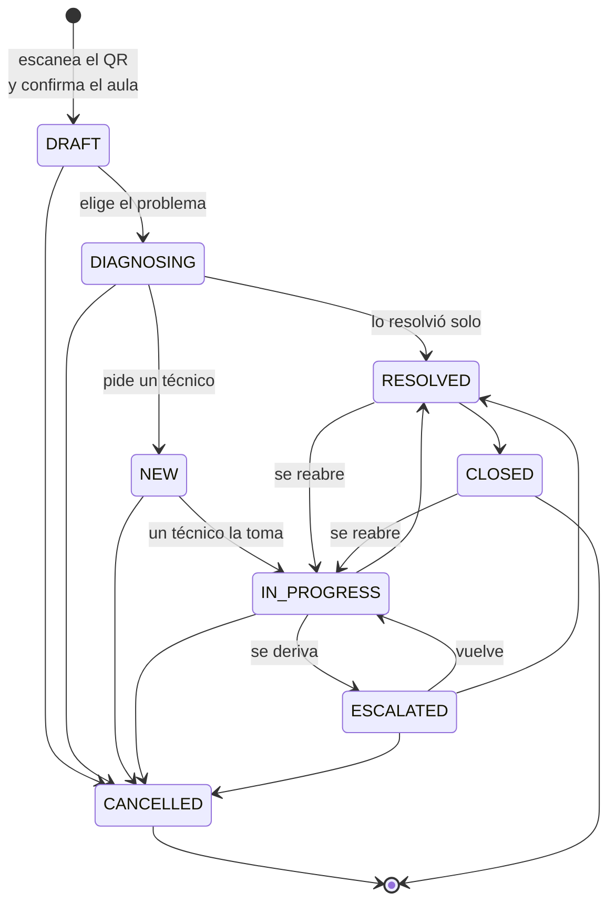
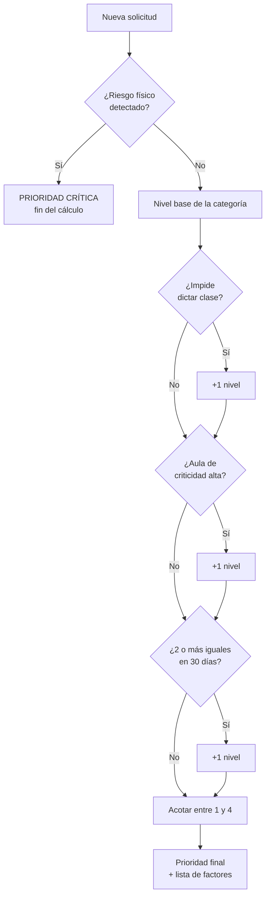

# 04 · Ciclo de vida de la incidencia

> **Qué encuentras aquí:** los ocho estados por los que pasa un ticket, qué transiciones
> están permitidas y por qué, cómo se calcula la prioridad, y cómo se registra todo lo
> que ocurre.

---

## 4.1 Los ocho estados

| Estado | Código interno | Qué significa | ¿Cuenta como incidencia? |
|---|---|---|---|
| Borrador | `DRAFT` | El docente confirmó su aula pero aún no envió nada | **No** |
| En diagnóstico | `DIAGNOSING` | Está siguiendo los pasos guiados | **No** |
| Nueva | `NEW` | Se envió a soporte; nadie la ha tomado | Sí |
| En atención | `IN_PROGRESS` | Un técnico se hizo cargo | Sí |
| Escalada | `ESCALATED` | Derivada a un tercero (proveedor, otra área) | Sí |
| Resuelta | `RESOLVED` | El problema se solucionó | Sí |
| Cerrada | `CLOSED` | Terminada administrativamente | Sí |
| Cancelada | `CANCELLED` | Anulada; no era una incidencia real | Sí, como rechazo |

**La distinción crítica:** `DRAFT` y `DIAGNOSING` **no son incidencias**. Un docente que
entró, confirmó su aula y se fue sin reportar nada no generó un problema de soporte.
Contarlo inflaría los totales y hundiría artificialmente todos los porcentajes de
resolución.

Pero tampoco se ignoran: se cuentan aparte como **indicador de fricción**, que responde
la pregunta «¿cuánta gente entra y no llega a reportar?». Si ese número sale alto, es un
hallazgo legítimo sobre el coste del QR genérico.

---

## 4.2 Transiciones permitidas

### En tabla, por si el diagrama no se ve

| Desde | Puede pasar a |
|---|---|
| Borrador | En diagnóstico · Cancelada |
| En diagnóstico | Resuelta · Nueva · Cancelada |
| Nueva | En atención · Cancelada |
| En atención | Escalada · Resuelta · Cancelada |
| Escalada | En atención · Resuelta · Cancelada |
| Resuelta | Cerrada · En atención *(reapertura)* |
| Cerrada | En atención *(reapertura)* |
| Cancelada | **Nada. Es definitiva.** |

### Por qué existe una máquina de estados y no un simple campo

Sin ella, cualquier parte del código podría poner cualquier estado. Un ticket podría
pasar de «cancelado» a «resuelto», o de «nuevo» directamente a «cerrado» sin que nadie
lo atendiera. Ninguna de las dos cosas significa nada, y las dos aparecerían en las
métricas como si fueran reales.

La máquina de estados hace que **una transición inválida sea un error del programa**, no
un dato malo silencioso en la base de datos.

### Dos detalles deliberados

**El borrador no se cancela solo; lo purga una tarea programada.** Un docente que
abandona a mitad no está «cancelando»: simplemente se fue. Una tarea que corre cada hora
elimina los borradores abandonados hace más de 24 horas.

**«Cancelada» no admite salida.** Si un ticket cancelado pudiera revivir, el registro de
por qué se canceló dejaría de tener sentido. Si hace falta, se crea uno nuevo.

---

## 4.3 Qué se registra en cada cambio

Cada transición genera una fila en `incident_events` con:

| Dato | Para qué |
|---|---|
| Tipo de evento | Qué clase de cambio fue |
| Valor anterior y nuevo | De dónde a dónde |
| Quién lo hizo | Usuario, o el sistema |
| Cuándo | Marca de tiempo exacta |
| Metadatos | Los **factores** que explican decisiones automáticas |

Esa tabla **solo admite inserciones**. No se modifica ni se borra. Es lo que permite
responder «¿por qué este ticket terminó así?» sin preguntarle a nadie y sin depender de
la memoria de quien lo atendió.

Los metadatos son lo que hace la diferencia: cuando el sistema fija una prioridad alta,
no guarda solo «prioridad = alta», guarda **la lista de razones** que la produjeron. Eso
se le muestra al técnico en el detalle del ticket.

---

## 4.4 Cálculo de la prioridad

La prioridad **la fija siempre el sistema**. El docente aporta una señal —«esto impide
continuar la clase»— pero no elige el valor.

### Por qué el docente no elige

Si pudiera, todo llegaría marcado como urgente. No por mala fe: porque desde donde está
el docente, su problema **es** el urgente. El resultado sería que el campo dejaría de
ordenar el trabajo de soporte, que es exactamente para lo que existe.

### El algoritmo

### Los factores, uno por uno

| Factor | Efecto | Por qué |
|---|---|---|
| **Riesgo físico** | Crítica, y se acaba el cálculo | No compite con los demás. Que el aula sea poco importante o que sea la primera vez no hace menos urgente un equipo que echa humo. |
| **Categoría** | Nivel base | Cada tipo de problema tiene su urgencia típica. Configurable. |
| **Impide dictar clase** | +1 | El factor de mayor peso. No es lo mismo un proyector que falla en un aula vacía que uno con cuarenta personas esperando. |
| **Aula crítica** (nivel 3 o 4) | +1 | Auditorios y laboratorios afectan a más gente. |
| **Reincidencia** (2 o más iguales en 30 días) | +1 | Un problema que vuelve suele significar que la reparación anterior no atacó la causa. |

El resultado se acota entre 1 (baja) y 4 (crítica), y **cada factor que sumó queda
escrito** en el evento correspondiente.

### La reincidencia excluye borradores

Un docente que entró y no completó no es una incidencia, y no debe inflar la prioridad
de las siguientes. Ese detalle parece menor y no lo es: sin él, cualquier aula con mucho
tráfico de borradores acabaría con prioridades infladas.

---

## 4.5 Detección de riesgo físico

Es la única decisión del sistema donde equivocarse tiene consecuencia física.

### Qué hace

Si el docente escribe algo como «sale humo del proyector», «huele a quemado» o «hay
chispas», el sistema:

1. **Se salta el diagnóstico guiado por completo.**
2. Escala de inmediato con prioridad máxima.
3. Le dice explícitamente que **no manipule el equipo**, que no lo desconecte y que aleje
   a los estudiantes.
4. Avisa a soporte marcando el ticket con el aviso de riesgo, por encima de todo lo demás
   en la pantalla.

### Por qué se salta el diagnóstico

Porque abrir el árbol del proyector significaría pedirle al docente que revise el cable
HDMI, es decir, **pedirle que se acerque a un equipo que puede estar quemándose**.

### Por qué es por palabras clave y no por modelo de lenguaje

Esta es una decisión que conviene explicar bien, porque a primera vista parece un
retroceso técnico.

| Criterio | Palabras clave | Modelo de lenguaje |
|---|---|---|
| Funciona con la IA apagada | **Sí** | No |
| Es determinista | **Sí** | No |
| Se puede auditar leyéndolo | **Sí** | No |
| Entiende frases que no previmos | No | Sí |

En cualquier otra decisión del sistema, el modelo sería mejor opción. Aquí no, porque un
falso negativo tiene consecuencia física y no puede depender de que Ollama esté
arrancado ni de cómo responda hoy el modelo.

### La asimetría que gobierna el umbral

- Si el sistema **escala de más**: alguien se acerca a un aula donde no hacía falta.
  Molesto y barato.
- Si el sistema **escala de menos**: alguien manipula un equipo que echa humo.

La diferencia entre los dos errores es tan grande que no hay nada que optimizar. El
sistema está deliberadamente sesgado hacia el falso positivo.

### Detalle de implementación

Las palabras se guardan sin tildes y en minúscula, y el texto del docente se normaliza
antes de comparar: «sale humo» y «salé humó» tienen que detectarse igual. Además son
fragmentos y no palabras completas — «quema» atrapa también «quemado» y «quemándose»,
que es como la gente escribe de verdad.

---

## 4.6 Tipos de resolución

Cuando un ticket se cierra, hay que declarar **cómo** se resolvió. Es obligatorio.

| Tipo | Significa | Por qué se distingue |
|---|---|---|
| `assistant` | El docente lo resolvió solo con el diagnóstico | **Es el indicador central de la investigación.** |
| `remote` | Soporte lo resolvió sin ir al aula | Ahorro de desplazamiento. |
| `onsite` | Hizo falta ir físicamente | El caso más costoso. |
| `none` | No se resolvió | Se cancela o se deriva. |

Además, **las notas de resolución son obligatorias**. Un ticket cerrado sin explicación
no enseña nada, no alimenta la base de conocimiento y no permite analizar la recurrencia.

---

## 4.7 Reapertura

Un ticket resuelto o cerrado se puede reabrir, y cada reapertura incrementa un contador.

**Por qué se cuenta:** porque la tasa de reapertura es una medida directa de la calidad
de la resolución. Un sistema que cierra rápido y reabre mucho no está resolviendo, está
cerrando.

La reapertura exige un motivo escrito. Sin él, el contador subiría sin que nadie pudiera
después analizar por qué.

---

## 4.8 Fusión de incidencias

Si dos docentes reportan el mismo problema en la misma aula, el segundo puede **sumarse**
a la solicitud existente en lugar de crear una nueva.

**Por qué importa:** sin esto, un problema que afecta a un aula muy usada generaría cinco
tickets para un solo desplazamiento. Las métricas contarían cinco incidencias donde hubo
una, y el técnico vería su bandeja llena de duplicados.

El campo `merged_into_id` guarda la relación, y el detalle del ticket muestra cuántas
personas más reportaron lo mismo — que es a la vez una señal de urgencia real.
