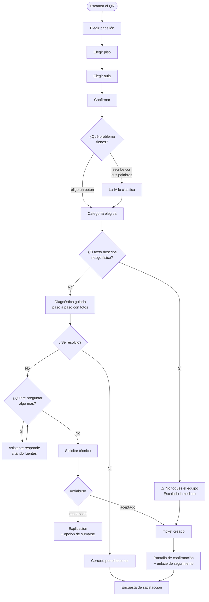

# 05 · El flujo del docente

> **Qué encuentras aquí:** todo lo que ve y hace un docente desde que escanea el QR,
> pantalla por pantalla, con la justificación de cada decisión de diseño.

---

## 5.1 El recorrido completo

Son **veinticinco rutas** dedicadas al docente, ninguna de ellas autenticada.

---

## 5.2 Paso 1 · Localizar el aula

El docente escanea un QR que lleva a `/reportar`. El mismo QR está en todas las aulas.

### La cascada

| Pantalla | Qué muestra |
|---|---|
| Pabellón | Solo los pabellones activos de la sede |
| Piso | Solo los pisos de ese pabellón |
| Aula | Solo las aulas de ese piso |
| Confirmar | El código del aula en grande, para verificarlo |

### La búsqueda directa

Hay además un buscador (`/reportar/buscar`): quien ya sabe que está en «C305» lo escribe
y llega en un paso. La cascada es para quien no recuerda el código exacto.

### Decisiones de esta etapa

**Por qué la cascada y no un desplegable único con las 121 aulas:** un desplegable de 121
elementos en un celular es inutilizable. Y tres listas cortas se recorren más rápido que
una larga, incluso sumando los toques.

**Por qué se muestra el código en grande antes de confirmar:** un ticket con el aula
equivocada es un dato falso que contamina la investigación **y** un técnico caminando al
sitio incorrecto. Vale la pena una pantalla más.

**Por qué solo se listan los elementos activos:** un aula clausurada no debe poder recibir
tickets nuevos, pero sí conserva su historial.

En este punto se crea el **borrador** y se guarda `confirmed_at`. Ese es el instante desde
el que se mide todo lo demás.

---

## 5.3 Paso 2 · Describir el problema

Dos caminos, a elección del docente.

### Camino A: escribir con sus palabras

El docente escribe libremente. La IA clasifica el texto en una de las categorías del
catálogo. Ver [07 · Inteligencia artificial](07-inteligencia-artificial.md).

Si la clasificación es clara, el sistema propone la categoría y sigue. Si no lo es,
muestra los botones.

### Camino B: elegir con botones

Una cuadrícula de categorías con iconos. Es el camino **principal**: funciona siempre,
sin IA, sin escribir nada.

### La decisión de fondo

El sistema **nunca depende** de que la clasificación acierte. La IA acelera el camino de
quien prefiere escribir; no lo sustituye. Si el modelo no está disponible, falla o
devuelve una categoría que no existe, el docente ve los botones y no se entera de nada.

---

## 5.4 La bifurcación por riesgo físico

Antes de cualquier otra cosa, el texto pasa por la detección de riesgo. Si contiene
señales de peligro, el flujo cambia por completo: no hay diagnóstico, hay aviso de no
tocar nada y escalamiento inmediato.

El detalle está en
[04 · Ciclo de vida](04-ciclo-de-vida-de-la-incidencia.md#45-detección-de-riesgo-físico).

---

## 5.5 Paso 3 · Diagnóstico guiado

El sistema recorre el árbol publicado de esa categoría, un paso a la vez, con fotos del
equipo real.

| Elemento de la pantalla | Por qué está |
|---|---|
| Un solo paso a la vez | El docente está de pie, con una clase esperando. Una lista de ocho pasos se lee mal y se abandona. |
| Foto del equipo real | «Revisa el cable HDMI» no significa nada para quien no sabe cuál es. La foto sí. |
| Botones grandes | Se usa de pie, con una mano, en un celular. |
| Opción de saltar | Si el docente ya lo intentó, obligarlo a repetirlo lo hace abandonar el canal. |

**Si no hay árbol cargado para esa categoría**, el sistema lo dice y ofrece reportar
directamente. Es un caso **normal**, no un error: mientras soporte no haya cargado los
procedimientos, es preferible ofrecer el reporte que inventar pasos.

El detalle del motor está en [09 · Diagnóstico guiado](09-diagnostico-guiado.md).

---

## 5.6 Paso 4 · Preguntar al asistente

En cualquier momento el docente puede hacer una pregunta abierta. El asistente responde
**solo** con lo que hay en los documentos cargados, y cita de dónde lo sacó.

Si no encuentra respaldo suficiente, dice que no lo sabe y ofrece escalar. No completa
con conocimiento general del modelo.

El detalle está en
[08 · Conocimiento y recuperación](08-conocimiento-y-recuperacion.md).

---

## 5.7 Paso 5A · Se resolvió solo

El docente marca que el problema se resolvió. El ticket se cierra con tipo de resolución
`assistant`.

**Este es el indicador central de la investigación:** qué proporción de problemas se
resuelven sin que soporte se mueva.

---

## 5.8 Paso 5B · Pedir un técnico

La pantalla de escalamiento pide tres cosas y ofrece una cuarta:

| Campo | Obligatorio | Por qué |
|---|---|---|
| ¿Impide continuar la clase? | Sí | Es el factor de mayor peso en la prioridad. |
| Confirmación explícita | Sí | Evita los envíos accidentales, que son la causa más frecuente de ruido. |
| Foto | **No** | Ayuda mucho al técnico, pero nadie puede quedar bloqueado porque la cámara no abre. |
| Dato de contacto | No | Por si el técnico necesita coordinar. |

### Detalles de implementación de esta pantalla

**El campo de foto abre la cámara trasera directamente**, sin pasar por la galería: el
docente tiene el problema delante.

**Hay un campo trampa oculto** que las personas no ven y los bots rellenan. Se prefiere
esto a un CAPTCHA porque un CAPTCHA contradice de frente el requisito de que el sistema
sea usable por docentes con poca familiaridad tecnológica.

**Se registra cuándo se abrió el formulario.** Un envío en menos de tres segundos no lo
hizo una persona leyendo la pantalla.

---

## 5.9 Los controles antiabuso

Antes de crear el ticket, la solicitud pasa por seis controles. El principio que los
gobierna: **mirar es gratis, movilizar a un técnico no.**

El diagnóstico guiado es completamente abierto. Lo que se protege es la acción costosa:
crear un ticket que hace caminar a una persona hasta un aula.

| Orden | Control | Qué detecta |
|---|---|---|
| 1 | Confirmación | No marcó la casilla |
| 2 | Señal de bot | Envío instantáneo o campo trampa relleno |
| 3 | Duplicado | Ya hay una solicitud abierta por lo mismo en esa aula |
| 4 | Aula saturada | Esa aula ya tiene varias solicitudes abiertas |
| 5 | Límite por dispositivo | Muchas solicitudes desde el mismo navegador en una hora |
| 6 | Límite por red | Muchas solicitudes desde la misma IP en una hora |

**Los dos primeros no tocan la base de datos.** Es deliberado: un bot que dispara mil
peticiones no debe costar mil consultas.

### El límite por IP es deliberadamente laxo

En la WiFi institucional muchos docentes comparten la misma dirección de salida. Un
umbral estrecho bloquearía usuarios legítimos. Está fijado en treinta por hora y **nunca
es el control principal**.

### Cada rechazo se explica y ofrece salida

Un rechazo nunca es una pantalla de error genérica. Dice qué pasó y qué hacer:

| Motivo | Qué se le dice al docente |
|---|---|
| Duplicado | «Ya hay una solicitud abierta para este mismo problema. **Puedes sumarte a ella.**» |
| Aula saturada | «Soporte ya está al tanto. Puedes sumarte a una de las solicitudes.» |
| Límite por dispositivo | «Espera unos minutos. Si es urgente, llama a soporte.» |
| Bot | «El formulario se envió demasiado rápido. Espera un momento y vuelve a enviarlo.» |

**Todos los rechazos se guardan** en su propia tabla, con el motivo. Los umbrales
actuales son provisionales y se van a recalibrar en la primera semana del piloto
observando esa tabla — no de memoria.

### Sumarse a una solicitud existente

Cuando el rechazo es por duplicado, el docente puede sumarse. El resultado es un solo
ticket con la nota de que varias personas reportaron lo mismo, lo que además es una señal
real de urgencia.

---

## 5.10 Paso 6 · Confirmación y seguimiento

Tras crear el ticket, el docente ve:

1. El número de ticket.
2. Un mensaje claro de que soporte ya fue avisado.
3. **Un enlace para consultar el estado**, que puede guardar.
4. La opción de reportar otro problema.

### La pantalla de seguimiento

Con el identificador único del ticket, sin contraseña, el docente ve una línea de tiempo
con lo que ya ocurrió:

| Hito | Se muestra cuando |
|---|---|
| Enviaste la solicitud | Siempre |
| Soporte la recibió | Alguien la vio |
| Un técnico se hizo cargo | Fue asignada |
| El técnico llegó al aula | Se registró la llegada |
| Problema resuelto | Se marcó resuelta |

**Solo se muestran los hitos que ya ocurrieron.** Una lista con pasos futuros en gris
haría creer que el sistema sabe cuándo van a ocurrir, y no lo sabe.

**No se muestra el nombre del técnico.** Es deliberado: mostrarlo invita a contactarlo
por WhatsApp y a saltarse el canal que se está midiendo. El docente necesita saber que
alguien se hizo cargo, no a quién buscar.

La pantalla se refresca sola cada treinta segundos mientras el problema siga abierto, y
**deja de refrescarse cuando la pestaña no está visible** — no tiene sentido gastar
batería recargando algo que nadie está mirando.

---

## 5.11 Paso 7 · Encuesta de satisfacción

Una sola pregunta al final. Es corta a propósito: cualquier cosa más larga se abandona, y
una encuesta abandonada no produce dato.

---

## 5.12 Principios de diseño de toda la interfaz del docente

| Principio | Cómo se aplica |
|---|---|
| **Se usa de pie, con una mano** | Botones de al menos 60 píxeles de alto, una acción principal por pantalla |
| **Con una clase esperando** | Nunca más de un paso a la vez; siempre se puede saltar adelante |
| **En un celular de gama media** | Sin framework de JavaScript; las imágenes se limitan a 150 KB |
| **Sin vocabulario técnico** | «El proyector no muestra imagen», no «ausencia de señal de vídeo» |
| **Sin callejones sin salida** | Toda pantalla de error ofrece una acción concreta |
| **Sin autenticación, nunca** | Ni para reportar, ni para consultar el estado |
