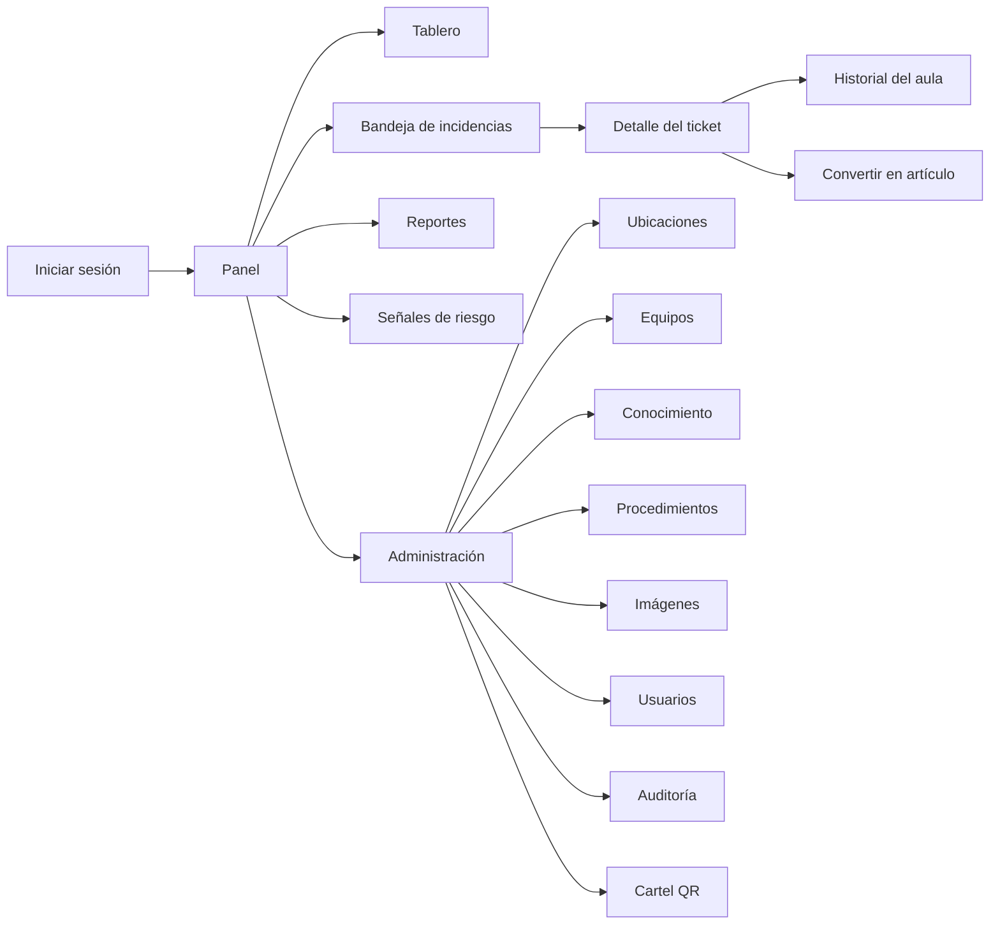
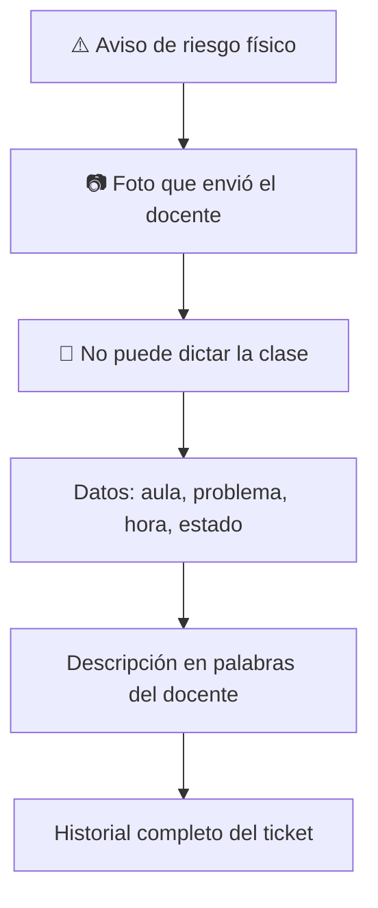
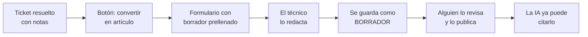

# 06 · El panel de soporte

> **Qué encuentras aquí:** todo lo que ve y hace el personal de soporte, desde que llega
> el aviso hasta que el ticket se cierra, y qué información se le da en cada momento.

---

## 6.1 Panorama del panel

El panel vive en `/panel` y exige inicio de sesión. Son **noventa y siete rutas**
agrupadas por permiso.

---

## 6.2 El aviso de incidencias nuevas

Sin aviso, una incidencia urgente espera a que alguien recargue la página. Al otro lado
hay un docente frente a su clase.

### Cómo funciona

El panel consulta cada **veinte segundos** si hay incidencias nuevas desde la última vez.
Si las hay, aparece un aviso visible con el conteo y un enlace directo.

### Por qué consulta periódica y no WebSockets

| Criterio | Consulta periódica | WebSockets |
|---|---|---|
| Infraestructura extra | Ninguna | Servidor de mensajería permanente |
| Funciona sobre XAMPP | Sí | Requiere configuración adicional |
| Latencia | Hasta 20 s | Inmediata |
| Quién lo mantiene | Nadie | Alguien |

Veinte segundos de retraso es irrelevante para un problema que se resuelve en minutos.
Un servicio de mensajería que nadie mantiene en una computadora de la universidad sí es
un problema real.

---

## 6.3 La bandeja de incidencias

La lista de tickets, con filtros por estado, prioridad, aula, categoría y técnico
asignado.

El orden por defecto pone arriba lo que más duele: prioridad, y dentro de la misma
prioridad, lo más antiguo primero.

---

## 6.4 El detalle del ticket

Es la pantalla más importante del panel. Su objetivo declarado: **que el técnico no tenga
que volver a preguntarle al docente nada de lo que el sistema ya sabe.**

### Orden de la información, y por qué ese orden

| Bloque | Por qué está donde está |
|---|---|
| **Riesgo físico** | Primero de todo. El técnico tiene que saberlo **antes de salir**, porque cambia qué lleva y con quién coordina. |
| **La foto** | Arriba, junto a los avisos. El técnico decide qué llevar antes de salir; para eso tiene que verla antes de leer el detalle. |
| **No puede dictar clase** | Marca la urgencia real. |
| **Datos del aula y el problema** | Incluye un enlace directo al **historial de esa aula**. |
| **En palabras del docente** | Su descripción literal, sin reinterpretar. |
| **Historial del ticket** | Cada evento con su hora, su autor y, cuando la decisión fue automática, **los factores que la explican**. |

### La explicación de la prioridad

Cuando el sistema fijó una prioridad, el historial muestra la lista de razones: «El
problema impide continuar la clase (+1)», «3 incidencias iguales en esta aula en los
últimos 30 días (+1)».

**Por qué:** una prioridad sin explicación se percibe como arbitraria y termina
ignorándose. El campo dejaría de ordenar el trabajo.

### La foto no se sirve desde una carpeta pública

Va por un controlador que verifica permisos, con cabeceras que impiden que se guarde en
caché compartida. La foto puede mostrar una pizarra con nombres o una pantalla con datos:
nadie decidió publicar eso.

---

## 6.5 Acciones sobre un ticket

| Acción | Permiso | Qué hace |
|---|---|---|
| Tomar | `incidents.assign` | Se lo asigna a sí mismo. Un botón, sin desplegables. |
| Asignar | `incidents.assign` | Se lo asigna a otro técnico. |
| Resolver | `incidents.update` | Exige tipo de resolución **y** notas escritas. |
| Cerrar | `incidents.close` | Cierre administrativo. |
| Reabrir | `incidents.close` | Exige un motivo escrito. |
| Cancelar | `incidents.cancel` | Exige un motivo escrito. Es definitivo. |

### Por qué las notas de resolución son obligatorias

Un ticket cerrado sin explicación:

- no enseña nada al siguiente técnico,
- no alimenta la base de conocimiento,
- no permite analizar por qué un problema se repite.

La pantalla lo dice explícitamente al pedirlas, para que no se lea como burocracia.

---

## 6.6 Historial del aula

Se llega desde el detalle de cualquier ticket: «Ver qué ha fallado antes aquí».

### Para qué sirve de verdad

Para que **el técnico salga con la pieza correcta en la mano**. Si en C305 las últimas
tres veces fue el cable HDMI, ir sin cable garantiza un segundo viaje — y el segundo
viaje es exactamente el coste que el proyecto existe para reducir.

### Qué muestra, en orden

| Bloque | Contenido |
|---|---|
| **Qué falla en esta aula** | Cada tipo de problema, cuántas veces, y cuántas de esas requirieron ir |
| **Riesgo** | El score del aula con sus factores explicativos |
| **Cómo se resolvió las últimas veces** | Las últimas cinco soluciones, **tal como las escribió el técnico** |
| **Equipos del aula** | Inventario con el estado de cada uno |
| **Todas las incidencias** | La lista completa, paginada |

**Lo primero no es la lista de incidencias**, sino qué falla y cómo se arregló. La lista
viene después, para quien quiera el detalle.

**Las soluciones se muestran literales**, sin resumir. El texto exacto del técnico es lo
que evita el segundo viaje; un resumen automático perdería justo el detalle que importa.

---

## 6.7 El tablero de métricas

Muestra los indicadores operativos del periodo elegido.

### Lo que lo distingue: los indicadores incómodos

El tablero muestra **también** los números que no favorecen al sistema:

| Indicador | Qué revela |
|---|---|
| Abandonos | Cuánta gente entra y no llega a reportar |
| Rechazos del antiabuso, por motivo | Si se está bloqueando a docentes legítimos |
| Reaperturas | Si se está cerrando sin resolver |

**Por qué:** un tablero que solo enseña lo que salió bien no sirve para tomar decisiones
ni para sostener una investigación. Y si aparecen rechazos por límite de red, hay que
revisar los umbrales — probablemente se esté bloqueando a docentes que comparten la WiFi.

El detalle de cada indicador está en
[14 · Métricas e investigación](14-metricas-e-investigacion.md).

---

## 6.8 Reportes

Responden una pregunta distinta a la del tablero:

| Herramienta | Pregunta que responde |
|---|---|
| **Tablero** | ¿Cómo va el servicio ahora? |
| **Reportes** | ¿Dónde se concentra el problema? |

La segunda es la que sostiene una decisión: cambiar los proyectores del pabellón C,
reforzar el turno de la tarde, comprar cables.

### Agrupaciones disponibles

Periodo · pabellón · aula · tipo de problema · tipo de equipo · técnico · mes.

Con filtros por rango de fechas, pabellón, categoría y técnico.

### Columnas de cada fila

Incidencias · impidieron la clase · resueltas sin visita · requirieron visita · todavía
abiertas · minutos promedio hasta resolver.

### Tres decisiones de este módulo

**Los filtros van por la dirección web.** Así el reporte que alguien mira se puede pegar
en un correo como enlace, y quien lo abre ve exactamente lo mismo.

**Avisa cuando hay pocos casos.** Con menos de treinta incidencias en el periodo, aparece
una advertencia: las diferencias entre filas pueden ser casualidad. Este reporte va a
acabar citado en la tesis, y con seis incidencias «el 50 % en el pabellón C» son tres
tickets.

**El CSV lleva el periodo escrito dentro del archivo.** Un CSV suelto sin su rango de
fechas no se puede citar: no se sabe de qué habla.

---

## 6.9 Señales de riesgo

Una lista de aulas ordenada por su score, con la banda (bajo, medio, alto) y **siempre**
los factores que explican el número.

La pantalla incluye una advertencia explícita sobre cómo leerlo: **ordena por dónde
revisar, no es una probabilidad de avería**. Ver [10 · Modelo de riesgo](10-modelo-de-riesgo.md).

---

## 6.10 Convertir una solución en artículo

La mayor parte del conocimiento útil de soporte no está en ningún manual. Está en la
cabeza del técnico que ya arregló esto tres veces. Cada vez que resuelve un ticket y
escribe qué hizo, ese saber queda enterrado en una fila que nadie vuelve a leer.

### Cómo funciona

El sistema prellena un borrador con lo que ya sabe: el problema descrito por el docente,
el diagnóstico técnico y las notas de resolución. El técnico lo corrige y lo completa.

### Cuándo NO se ofrece, y por qué

| Situación | Motivo |
|---|---|
| El ticket sigue abierto | Un artículo sacado de un ticket abierto documenta algo que aún no se sabe si funcionó |
| Se cerró sin notas | No hay nada que documentar |
| Ya salió un artículo de ese ticket | Evita duplicados |

### Dos decisiones deliberadas

**El artículo nace en borrador, nunca publicado.** Una nota de resolución se escribe para
un compañero que conoce el contexto: puede decir «lo de siempre», nombrar a una persona o
describir un apaño que solo vale para esa aula. Publicarla automáticamente equivale a que
el asistente empiece a recomendársela a todos los docentes de la sede.

**El técnico redacta; el sistema solo adelanta.** Copiar la nota tal cual produciría
artículos como «cambié el cable», inútiles para quien no estuvo ahí. El formulario exige
un mínimo de extensión precisamente para impedir eso.

### Trazabilidad

El artículo guarda de qué ticket salió, y esa procedencia se escribe **dentro del propio
archivo**, no solo en la base de datos: el archivo se puede descargar y circular por
correo, y un procedimiento suelto sin fecha ni origen se sigue aplicando años después de
haber dejado de ser cierto.

---

## 6.11 Administración

| Sección | Permiso | Qué permite |
|---|---|---|
| Ubicaciones | `locations.manage` | Sedes, pabellones, pisos, aulas. Con importación desde CSV. |
| Categorías | `catalogs.manage` | El catálogo de tipos de problema. |
| Equipos | `equipment.manage` | Inventario por aula. Con importación desde CSV. |
| Conocimiento | `knowledge.manage` | Cargar, versionar, publicar y reindexar documentos. |
| Procedimientos | `diagnostics.manage` | Definir y versionar los árboles de diagnóstico. |
| Imágenes | `media.manage` | El banco de fotos de los equipos. |
| Usuarios | `users.manage` | Cuentas y roles. |
| Auditoría | `audit.view` | Quién cambió qué y cuándo. |
| Cartel QR | `locations.manage` | Genera el cartel imprimible. |

### La importación no escribe hasta que se lo confirmas

Primero muestra qué va a crear, qué va a actualizar y qué filas tienen problemas. Recién
entonces se decide.

**Por qué:** cargar mal el catálogo de aulas afecta a **todos** los tickets, incluidos los
ya cerrados que la investigación va a analizar.

---

## 6.12 Por qué un técnico no puede administrar catálogos

No es desconfianza. Es que un cambio accidental en el catálogo de aulas, de estados o de
categorías afecta a todos los tickets del sistema, incluidos los históricos.

Del mismo modo, el rol de **investigador** es de solo lectura con permiso de exportación,
separado del rol operativo: si el investigador usara una cuenta de administrador para
extraer datos, sus acciones quedarían mezcladas con las de soporte en la auditoría y
contaminarían las métricas del piloto.

La tabla completa de roles y permisos está en
[11 · Seguridad y privacidad](11-seguridad-y-privacidad.md#112-roles-y-permisos).
