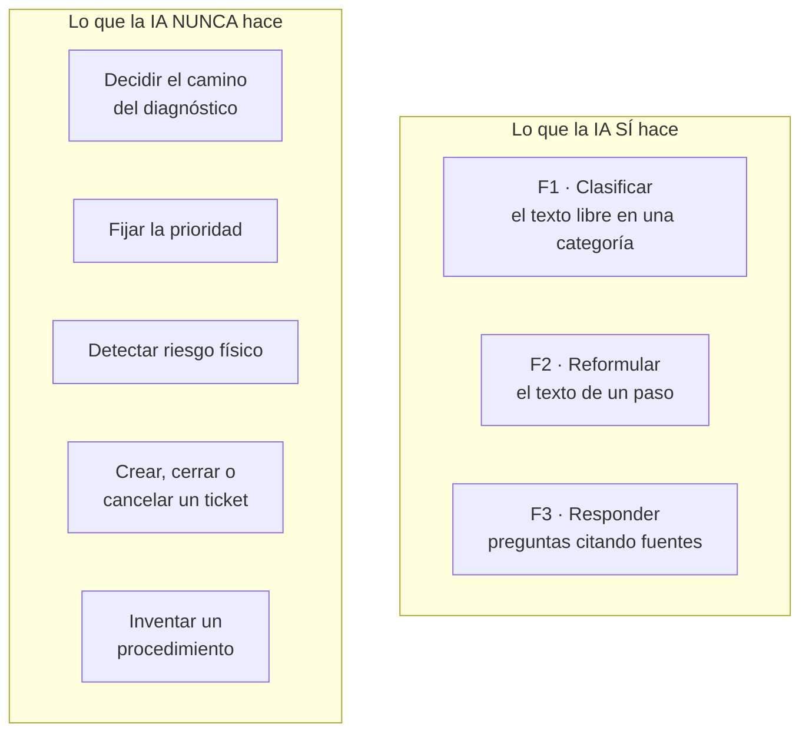
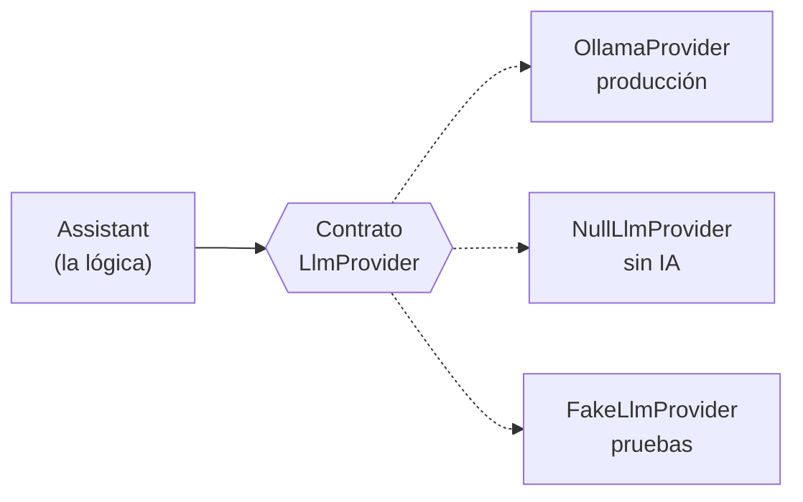
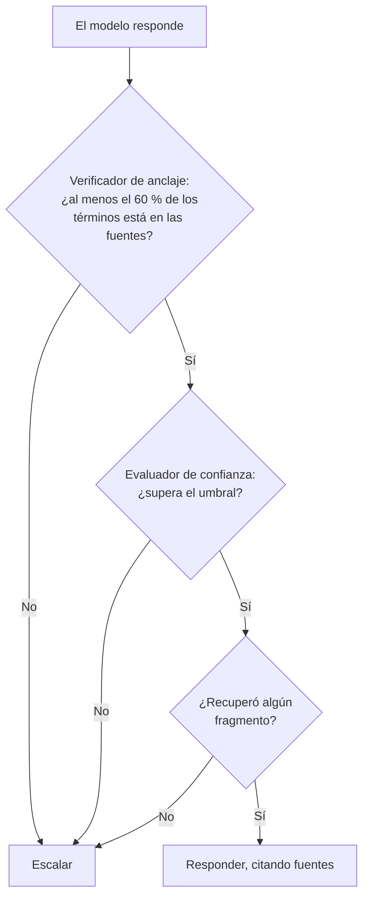

# 07 · Inteligencia artificial

> **Qué encuentras aquí:** qué modelo se usa, por qué es local, exactamente qué decide y
> qué no decide, y qué pasa cuando falla. Es el capítulo central del proyecto.

---

## 7.1 Qué modelo se usa

| Componente | Elección | Tamaño | Para qué |
|---|---|---|---|
| Motor | **Ollama** | ~1 GB | Ejecuta modelos de lenguaje en la propia computadora |
| Modelo de lenguaje | **Qwen 2.5, 7B instruct** | ~4,7 GB | Clasificar, reformular, responder |
| Modelo de vectores | **nomic-embed-text** | ~275 MB | Convertir texto en vectores de 768 dimensiones para la búsqueda semántica |

Total en disco: aproximadamente **6 GB**.

### Por qué local y no un servicio en la nube

| Criterio | Modelo local (elegido) | API en la nube |
|---|---|---|
| Coste | Cero | Por consulta, indefinidamente |
| Datos del docente | Nunca salen de la computadora | Salen a un tercero |
| Depende de internet | No | Sí |
| Sostenible tras el semestre | Sí | Solo mientras alguien pague |
| Calidad del modelo | Menor | Mayor |

La restricción del proyecto era explícita: **sin servicios de pago obligatorios**. Pero
aunque no lo fuera, un sistema de tesis que deja de funcionar cuando se acaba el crédito
de una tarjeta no es un sistema entregable a una institución.

El precio que se paga es real: un modelo de 7 mil millones de parámetros ignora
instrucciones con más frecuencia que uno grande. **Toda la arquitectura de la IA está
construida asumiendo eso**, y por eso hay verificación en código en vez de confianza en
el prompt.

### Por qué Qwen 2.5 y no otro modelo de tamaño similar

Se probó contra frases reales de docentes peruanos. Los criterios fueron: que respete el
formato JSON pedido, que entienda español coloquial, y que quepa en una computadora sin
tarjeta gráfica dedicada.

---

## 7.2 Las tres funciones de la IA, y sus límites

Esto es lo más importante del capítulo. La IA hace **tres cosas** y ninguna de ellas es
decidir qué hacer.

### F1 · Clasificación de intención

El docente escribe «el cañón no prende». La IA responde con una categoría del catálogo y
un número de confianza.

**Es el único punto donde el modelo toca el camino principal**, y está acotado al máximo:

1. La respuesta se **valida contra el catálogo real** de categorías.
2. Si el modelo devuelve una categoría que no existe, se descarta y se registra la
   advertencia.
3. Si el modelo no está o falla, se cae a coincidencia por palabras clave.
4. Si ninguna de las dos da nada claro, el docente elige con botones.

**El sistema nunca depende de que la clasificación acierte.** El camino de botones es el
principal; la IA solo lo acelera.

### F2 · Reformulación de un paso

Un paso escrito por soporte puede decir «verificar la integridad del conector HDMI en
ambos extremos». La IA lo reescribe como «Revisa que el cable HDMI esté bien enchufado
por los dos lados».

**Reglas que se le imponen:** no añadir pasos ni datos que no estén en el original, no
cambiar el significado, máximo dos frases.

**Salvaguarda en código:** si la reformulación sale vacía o **más de tres veces más larga
que el original**, se descarta y se usa el texto original. Una reformulación
desproporcionada suele significar que el modelo se inventó contenido.

### F3 · Respuesta a preguntas abiertas

El docente pregunta algo. El sistema busca en los documentos cargados, le pasa los
fragmentos al modelo y le pide que responda **solo** con eso.

El detalle completo está en
[08 · Conocimiento y recuperación](08-conocimiento-y-recuperacion.md).

### Lo que la IA nunca hace, y por qué

| No hace | Por qué |
|---|---|
| **Decidir el camino del diagnóstico** | Seguridad: puede inventar un paso que dañe el equipo. Y método: si cada docente recibe un procedimiento distinto, el resultado del piloto no se puede atribuir a la intervención. |
| **Detectar riesgo físico** | Es la única decisión con consecuencia física. No puede depender de que Ollama esté arrancado. |
| **Fijar la prioridad** | Tiene que ser explicable factor por factor. |
| **Crear, cerrar o cancelar tickets** | Ninguna acción con efecto sobre personas se automatiza. |

---

## 7.3 La arquitectura de proveedores

`Assistant` no conoce a Ollama. Conoce una interfaz. Laravel decide cuál implementación
entregar según la configuración.

| Implementación | Cuándo | Qué hace |
|---|---|---|
| `OllamaProvider` | `LLM_PROVIDER=ollama` | Habla con el modelo local por HTTP |
| `NullLlmProvider` | `LLM_PROVIDER=null` (por defecto) | Devuelve «no sé» honestamente |
| `FakeLlmProvider` | En las pruebas | Responde de forma predecible y sin red |

### Qué gana el proyecto con esto

1. **Las 442 pruebas corren sin tener Ollama instalado.** Eso permite integración continua
   en GitHub, donde no hay una GPU ni 6 GB para un modelo.
2. **El sistema funciona completo con la IA apagada.** Si esto deja de ser cierto, es un
   defecto — y así está escrito en la configuración del proyecto.
3. **Cambiar de modelo es cambiar una clase.** Si mañana hay un modelo mejor, o si la
   universidad autoriza un servicio en la nube, se escribe otra implementación del mismo
   contrato y nada más cambia.

---

## 7.4 El prompt de clasificación y el glosario peruano

Este es el detalle que más diferencia hace en la práctica, y merece explicación.

### El problema

Un modelo entrenado con español general **no sabe** que en un aula peruana «cañón»
significa proyector. Clasificaba esa palabra como **micrófono**, porque en español
general «cañón» se asocia a otras cosas.

Un docente escribiendo «el cañón no prende» —que es exactamente como se dice— recibía la
categoría equivocada.

### La solución

El prompt incluye un glosario del vocabulario real de un aula peruana:

| Lo que dice el docente | Lo que significa |
|---|---|
| cañón, cañon, proyector multimedia | El proyector |
| compu, la máquina | La computadora |
| ecran | La pantalla de proyección |
| no jala, no prende, está malogrado | No funciona |

Además, una advertencia directa: **«cañón» significa proyector, nunca computadora ni
micrófono**.

### Lo que NO funcionó

Se intentó primero con **ejemplos en prosa** dentro del prompt («Ejemplo: el docente dice
X, la categoría es Y»). El resultado fue **peor**: los ejemplos en prosa arrastraban al
modelo a responder también en prosa, en lugar del JSON que se le pedía.

La advertencia directa y corta funcionó mejor. El acierto pasó a 10 de 10 en los casos de
prueba.

**Ese hallazgo está protegido por pruebas automáticas:** si alguien recorta el glosario,
las pruebas fallan y lo dicen.

### Temperatura cero

Al clasificar, la temperatura del modelo se fija en **0**. No se busca variedad: se busca
que **el mismo síntoma produzca siempre la misma categoría**.

De eso depende que el recorrido del docente sea reproducible, y de la reproducibilidad
depende que la investigación pueda atribuir resultados a la intervención en vez de al
azar de una generación.

---

## 7.5 Las reglas que se le imponen al modelo al responder

Cuando el asistente responde una pregunta, el prompt incluye estas reglas estrictas:

| Regla | Por qué |
|---|---|
| Si las fuentes no contienen la respuesta, responde `NO_SE` | Es el desenlace **correcto**, no un fallo. Escalar es preferible a improvisar. |
| No añadas datos, pasos ni recomendaciones que no estén en las fuentes | Es la definición de alucinación |
| No inventes procedimientos, políticas, teléfonos ni nombres | Son exactamente los datos institucionales que no se pueden fabricar |
| No sugieras abrir equipos ni manipular cableado eléctrico | Seguridad física del docente |
| Máximo tres frases, tuteando | Se lee de pie con una clase esperando |
| No digas que algo «definitivamente funcionará» | Certeza que el sistema no tiene |

---

## 7.6 Por qué el prompt no basta, y qué se hace además

**Un prompt no es una garantía.** Un modelo local pequeño ignora instrucciones con más
frecuencia de la que sería cómodo admitir, y «le dijimos que no inventara» no es un
control de seguridad.

Por eso hay tres capas de verificación **en código**, después de que el modelo responda:

### Capa 1 · Verificador de anclaje

Extrae los términos con contenido de la respuesta y mide qué proporción aparece también
en los pasajes recuperados. El umbral es **60 %**.

La lógica: una respuesta legítima reformula las fuentes, así que comparte casi todo su
vocabulario sustantivo. Una inventada introduce términos que no están en ninguna parte.

**Lo que esta capa NO detecta**, y conviene decirlo así en el informe en lugar de vender
una garantía que no existe: una respuesta que use las palabras correctas y las combine
mal («desconecta el cable HDMI para que aparezca la imagen»). Es una red de seguridad
contra la invención descarada, no una verificación semántica.

### Capa 2 · Evaluador de confianza

Ver la sección siguiente.

### Capa 3 · Regla dura

Si no se recuperó **ningún** fragmento, la respuesta se descarta sin importar lo alto que
salga el cálculo. No hay nada en qué apoyarse; responder sería inventar.

---

## 7.7 La política de confianza

Decide si el asistente responde o escala. **No es una fórmula inventada**: combina tres
señales objetivas y medibles.

### Las tres señales

| Señal | Qué mide | Cómo se calcula |
|---|---|---|
| **Recuperación** | ¿Existe conocimiento relevante? | Calidad del mejor resultado **y el margen** entre el primero y el tercero |
| **Clasificación** | ¿Está clara la intención? | La confianza que devolvió el clasificador |
| **Cobertura** | ¿Está sustentada la respuesta? | Proporción de fragmentos recuperados que aparecen realmente citados |

**Por qué el margen y no solo la mejor puntuación:** un margen pequeño significa que hay
varios fragmentos igual de «buenos», y eso es ambigüedad disfrazada de confianza.

**El bono por doble coincidencia:** un fragmento encontrado por **ambas** vías —la léxica
y la semántica— es la señal más fuerte que existe: coincide en palabras y en significado.

### La combinación

Los tres pesos son **iguales, un tercio cada uno**. Sin datos, no hay motivo para inclinar
la balanza — y elegir pesos distintos sería fingir una precisión que no se tiene.

### Las bandas

| Confianza | Banda | Qué hace el sistema |
|---|---|---|
| ≥ umbral alto | Alta | Responde |
| entre ambos | Media | Responde con reservas explícitas |
| < umbral bajo | Baja | **Escala** |
| Sin fragmentos recuperados | Baja, siempre | Escala |

### La asimetría deliberada

Los umbrales por defecto son **exigentes**: 0,75 para alta y 0,45 para baja. El sistema
escala de más.

Eso es intencional:

- **Escalar de más** cuesta un desplazamiento. Molesto y barato.
- **Responder mal con seguridad** puede hacer que un docente manipule el equipo
  equivocado.

El error barato y el caro no son simétricos, así que la política por defecto tampoco lo
es.

### Los umbrales están sin fijar, a propósito

En la configuración del proyecto, los dos umbrales están **vacíos**. Cuando lo están, el
sistema usa los valores conservadores de arriba.

Se dejan nulos deliberadamente: **mientras no existan datos, inventar un número aquí sería
fingir precisión**. Se van a calibrar contra un conjunto de preguntas etiquetadas por
soporte, maximizando el acierto de la decisión de escalar y priorizando no dejar pasar
casos que debían escalarse.

Ver [15 · Estado real del piloto](15-estado-real-del-piloto.md).

---

## 7.8 Degradación: qué pasa cuando algo falla

Esta tabla es la que responde «¿y si se cae la IA?».

| Falla | Qué hace el sistema | ¿Lo nota el docente? |
|---|---|---|
| Ollama no está arrancado | Clasifica por palabras clave; el asistente dice que no puede responder | Solo si intenta preguntar |
| Ollama tarda demasiado | Se corta a los 30 segundos y se cae al modo determinista | No |
| El modelo devuelve una categoría inexistente | Se descarta, se registra la advertencia, se cae a palabras clave | No |
| El modelo devuelve algo ilegible | Se trata como «desconocido» | No |
| La reformulación sale desproporcionada | Se usa el texto original | No |
| No hay documentos cargados | El asistente dice honestamente que no sabe | Sí, y es correcto |
| No hay árbol de diagnóstico | Ofrece reportar directamente | Sí, y es correcto |

**El principio:** cualquier fallo del modelo devuelve «desconocido» en vez de propagarse.
La IA es una comodidad, no una dependencia.

---

## 7.9 Todo queda registrado

Cada interacción con el asistente se guarda con:

- la pregunta y la respuesta,
- la confianza calculada y sus tres componentes,
- la decisión tomada (responder o escalar),
- qué fragmentos se citaron, con su puntuación,
- qué proveedor respondió y cuánto tardó.

**Para qué sirve:** para que la política de escalamiento sea **auditable y recalibrable
con datos reales**. Sin este registro, ajustar los umbrales sería adivinar.

---

## 7.10 Resumen para citar en la tesis

> El sistema emplea un modelo de lenguaje local (Qwen 2.5 7B, servido por Ollama) en tres
> funciones acotadas: clasificación de intención, reformulación de instrucciones y
> respuesta a preguntas abiertas con generación aumentada por recuperación. El modelo no
> interviene en ninguna decisión con consecuencia operativa o física: el árbol de
> diagnóstico, el cálculo de prioridad y la detección de riesgo son deterministas. La
> respuesta generada se somete a tres verificaciones en código —anclaje léxico en las
> fuentes, evaluación de confianza multiseñal y exigencia de recuperación no vacía— antes
> de mostrarse, y el sistema escala ante la duda. La totalidad del sistema opera de forma
> completa con el modelo desactivado.
