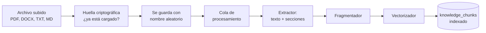
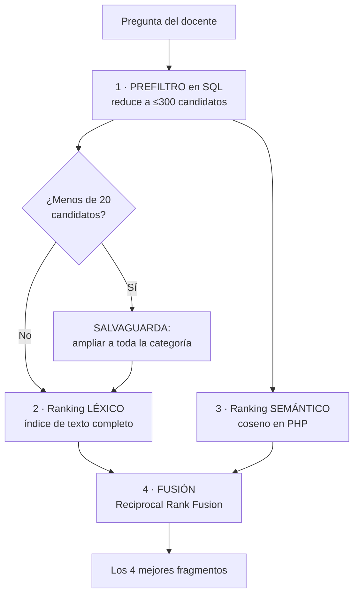
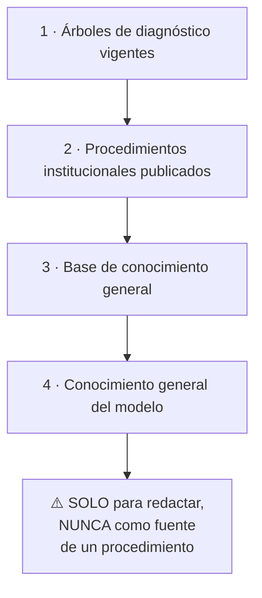

# 08 · Base de conocimiento y recuperación (RAG)

> **Qué encuentras aquí:** cómo entra un documento al sistema, cómo se convierte en algo
> buscable, y cómo se encuentra el fragmento correcto cuando un docente pregunta algo.
> Es la parte más técnica del proyecto.

---

## 8.1 Qué problema resuelve

Un modelo de lenguaje no conoce los procedimientos de la Universidad Continental. Si se
le pregunta directamente, **inventa** algo plausible: un procedimiento que suena bien y
no existe.

La técnica que resuelve esto se llama **RAG** (*Retrieval-Augmented Generation*,
generación aumentada por recuperación). En vez de preguntarle al modelo, se hace esto:

1. Se buscan los fragmentos de documentos relevantes para la pregunta.
2. Se le entregan al modelo junto con la pregunta.
3. Se le exige que responda **solo** con eso.
4. Se verifica en código que lo haya hecho.

El resultado es un asistente que **cita** en vez de inventar, y que dice «no lo sé» cuando
no hay respaldo.

---

## 8.2 De un PDF a un fragmento buscable

### Etapa 1 · Subida y detección de duplicados

Se calcula la **huella criptográfica** del archivo. Si ese archivo exacto ya está cargado
en ese documento, se rechaza.

**Por qué:** un manual de 80 páginas tarda varios minutos en vectorizarse. Reprocesarlo
para acabar con un índice idéntico es gasto puro.

El archivo se guarda con un **nombre aleatorio**, no con el original. El nombre original
puede revelar rutas internas o nombres de personas, y es una vía clásica de ataque por
recorrido de directorios.

### Etapa 2 · Procesamiento en segundo plano

La indexación va a una **cola**. Nadie espera mirando un formulario mientras se vectoriza
un manual.

Si falla, se reintenta **una vez**. Si falla dos veces seguidas, el problema es el
documento o el entorno, no la mala suerte, y se registra el error para que alguien lo
mire.

### Etapa 3 · Extracción de texto

Hay un extractor por formato, y todos cumplen el mismo contrato:

| Formato | Qué aprovecha |
|---|---|
| PDF | Texto y número de página |
| Word (.docx, .doc) | Texto y encabezados como límites de sección |
| Texto plano y Markdown | Encabezados (`#`, `##`…) como límites de sección |

**Detalle que importa en Windows:** los archivos guardados desde Windows suelen venir en
codificación ANSI y con marca de orden de bytes. Sin normalizar, las tildes se indexan
rotas y después nada coincide al buscar. El extractor lo corrige antes de nada.

**Markdown es el formato más cómodo** para que soporte escriba procedimientos nuevos sin
depender de Office.

### Etapa 4 · Fragmentación

Los documentos se parten en trozos de aproximadamente **450 tokens**, con **75 tokens de
solapamiento** entre trozos consecutivos.

**Por qué solapamiento:** para que una idea que cae justo en el corte no quede partida en
dos fragmentos que, por separado, no significan nada.

#### La regla que manda sobre todas las demás

**No se parte un procedimiento numerado.** Un procedimiento de ocho pasos se queda entero
aunque exceda el tamaño objetivo.

Esto no es un detalle de calidad. En un dominio de instrucciones, entregar «los pasos 1 al
4» como si fueran el procedimiento completo hace que **el docente crea que terminó cuando
va por la mitad**. Es la causa más común de respuestas incompletas y peligrosas en
sistemas como este.

El detector considera que hay un procedimiento cuando encuentra **tres o más líneas
consecutivas** que empiezan por número o viñeta. Tres y no dos, porque con dos podría ser
casualidad (una fecha, una enumeración corta dentro de un párrafo).

#### Cada fragmento lleva su contexto

Antes de vectorizarlo, se le prefija el **título del documento y su sección**. Eso mejora
la recuperación y es lo que permite después citar la fuente con precisión: «Manual del
proyector Epson, sección Conexiones, página 12».

### Etapa 5 · Vectorización

Cada fragmento se convierte en un vector de **768 dimensiones** usando
`nomic-embed-text`.

**Se guarda con qué modelo se generó.** Vectores de modelos distintos no son comparables:
compararlos daría un número sin significado que contaminaría el ranking **sin que nada
fallara visiblemente**. Por eso, al buscar, los fragmentos vectorizados con otro modelo se
descartan explícitamente.

---

## 8.3 La búsqueda híbrida

Aquí está la parte más interesante del sistema.

### Por qué híbrida y no solo vectorial

| Tipo de búsqueda | Falla con | Ejemplo |
|---|---|---|
| Solo vectorial | Términos exactos | «HDMI», «C305», «Epson EB-X41» |
| Solo léxica | Paráfrasis | «no se ve nada» vs. «ausencia de señal de vídeo» |

En este dominio ocurren **las dos cosas**: los docentes describen con sus palabras
(paráfrasis) y los manuales usan códigos y modelos exactos. Combinar no es un lujo.

### Las cuatro etapas

### Por qué ese orden de etapas

MariaDB 10.4 **no tiene índice vectorial**, así que el coseno se calcula en PHP. Para que
eso sea viable hay que reducir el conjunto **antes**: primero se prefiltra en SQL y solo
después se calcula la similitud sobre los candidatos.

Invertir el orden obligaría a recorrer toda la base en cada consulta.

### La salvaguarda, que es lo más importante de todo

El prefiltrado léxico tiene un problema evidente: **elimina justo los fragmentos que no
comparten vocabulario con la pregunta**, que son exactamente los que la búsqueda vectorial
debería rescatar.

Por eso, si el filtro devuelve **menos de 20 candidatos**, se amplía a toda la categoría
antes de calcular la similitud.

**Sin esta salvaguarda, el prefiltrado anularía el beneficio del vectorial precisamente en
el caso que lo justifica.**

### Por qué modo booleano

El índice de texto completo se consulta en **modo booleano**, no en modo natural.

El modo natural de MySQL/MariaDB descarta los términos que aparecen en más del **50 %** de
las filas. Con una base pequeña —exactamente la situación al arrancar el piloto, cuando
soporte ha subido uno o dos documentos— eso significa que **todos** los términos se
descartan y la búsqueda léxica no devuelve nada.

Y falla **en silencio**: no da error, solo deja de encontrar cosas. Peor aún, empieza a
funcionar sola cuando crece la base, lo que hace el problema extraordinariamente difícil
de diagnosticar.

El modo booleano no aplica ese umbral.

### Limpieza de la consulta del usuario

Los operadores booleanos (`+ - * " ~ < > ( ) @`) se **eliminan** del texto del docente.

Si alguien escribe «no funciona -nada», ese guion se interpretaría como «excluir nada» y
cambiaría el sentido de su propia búsqueda sin que él lo supiera.

También se descartan las palabras de menos de tres caracteres: el índice las ignora de
todos modos.

### La fusión: Reciprocal Rank Fusion

Los dos rankings se combinan con una técnica llamada **Reciprocal Rank Fusion**.

**Por qué RRF y no una media ponderada:** el score del índice de texto completo y la
similitud coseno **no son comparables entre sí** — están en escalas distintas y con
significados distintos. Cualquier intento de ponderarlos a mano sería un número inventado.

RRF combina **posiciones** en lugar de puntuaciones, y por eso no necesita normalizar
nada. A cada fragmento se le suma un valor que depende solo de en qué posición quedó en
cada ranking.

Un fragmento que aparece bien situado en **ambos** rankings gana sobre uno que arrasa en
uno solo — que es exactamente el comportamiento deseado.

### Parámetros

| Parámetro | Valor | Qué hace |
|---|---|---|
| Límite del prefiltro | 300 | Máximo de candidatos sobre los que se calcula el coseno |
| Mínimo del prefiltro | 20 | Por debajo de esto, se activa la salvaguarda |
| Constante de RRF | 60 | Valor estándar de la técnica |
| Fragmentos entregados al modelo | 4 | Los que se le pasan como contexto |
| Presupuesto de latencia | 800 ms | Objetivo de tiempo de la búsqueda |

---

## 8.4 La jerarquía de fuentes

Cuando el asistente responde, consulta las fuentes en **orden estricto**:

**Si los niveles 2 y 3 no aportan nada, el sistema escala.** No completa con el nivel 4.

Esa es exactamente la diferencia entre un asistente que reconoce sus límites y uno que
improvisa con la voz de la institución.

---

## 8.5 Qué se le muestra al docente

Cuando el asistente responde:

- La respuesta, en tres frases como máximo.
- **De qué documento y sección salió**, con enlace.
- Un aviso si la confianza fue media.
- La opción de escalar si no le sirvió.

Cuando no puede responder:

- Lo dice claramente.
- Ofrece el diagnóstico guiado o solicitar un técnico.
- **No inventa nada.**

---

## 8.6 Ciclo de vida de un documento

| Estado | Qué significa | ¿Lo usa la IA? |
|---|---|---|
| **Borrador** | Cargado, aún no revisado | No |
| **Publicado** | Revisado y aprobado | **Sí** |
| **Archivado** | Ya no vigente | No |

**Los documentos se archivan, no se borran.** Un documento archivado deja de alimentar al
asistente, pero sigue explicando **por qué** una incidencia pasada se resolvió como se
resolvió. Borrarlo dejaría esas respuestas sin fuente verificable.

### Versionado

Cada carga es una **versión nueva**, nunca una sobrescritura. Un procedimiento cambia con
el tiempo, y las incidencias atendidas bajo la versión antigua tienen que seguir siendo
interpretables contra ella.

### Reindexación

Una versión ya cargada se puede reprocesar. Sirve cuando se cambia el modelo de vectores
o cuando se corrige un error del fragmentador.

---

## 8.7 Qué se puede cargar y en qué formato

| Contenido | Formato | Dónde se sube |
|---|---|---|
| Manuales de equipos | PDF | Panel → Conocimiento |
| Procedimientos institucionales | PDF, DOCX | Panel → Conocimiento |
| Preguntas frecuentes | DOCX, MD, TXT | Panel → Conocimiento |
| Guías escritas por soporte | MD (lo más cómodo) | Panel → Conocimiento |
| Artículos nacidos de una solución | Se generan solos | Panel → detalle del ticket |

Cada documento puede asociarse a una **categoría**, lo que permite prefiltrar mejor: al
buscar sobre un problema de audio no hace falta mirar el manual del proyector.

La guía práctica de qué subir está en [`docs/carga-de-datos.md`](../carga-de-datos.md).

---

## 8.8 Límites conocidos de este diseño

Declararlos es parte del trabajo:

| Límite | Consecuencia | Cuándo importaría |
|---|---|---|
| El coseno se calcula en PHP | Funciona con miles de fragmentos, no con millones | Si el corpus creciera cien veces |
| Sin índice vectorial | La latencia crece con el número de candidatos | Igual |
| El verificador es léxico, no semántico | No detecta una respuesta con palabras correctas mal combinadas | Siempre; se compensa con las otras dos capas |
| El fragmentador estima tokens por caracteres | Aproximación grosera | Solo decide dónde cortar, no afecta a nada que dependa de precisión |
| Solo español | No indexa bien documentos en inglés | Si se cargaran manuales originales sin traducir |

---

## 8.9 Resumen para citar en la tesis

> La base de conocimiento implementa generación aumentada por recuperación sobre un motor
> relacional sin soporte vectorial nativo. La recuperación es híbrida: un prefiltro léxico
> en SQL reduce el espacio de búsqueda, sobre el que se calculan en paralelo un ranking
> léxico mediante índice de texto completo en modo booleano y un ranking semántico por
> similitud coseno; ambos se combinan mediante *Reciprocal Rank Fusion*, que opera sobre
> posiciones y evita la normalización arbitraria de puntuaciones heterogéneas. Una
> salvaguarda amplía el conjunto de candidatos cuando el prefiltro léxico resulta
> insuficiente, preservando la aportación de la búsqueda semántica en consultas
> parafraseadas. La fragmentación respeta la integridad de los procedimientos numerados,
> por el riesgo de entregar instrucciones incompletas como si fueran completas.
