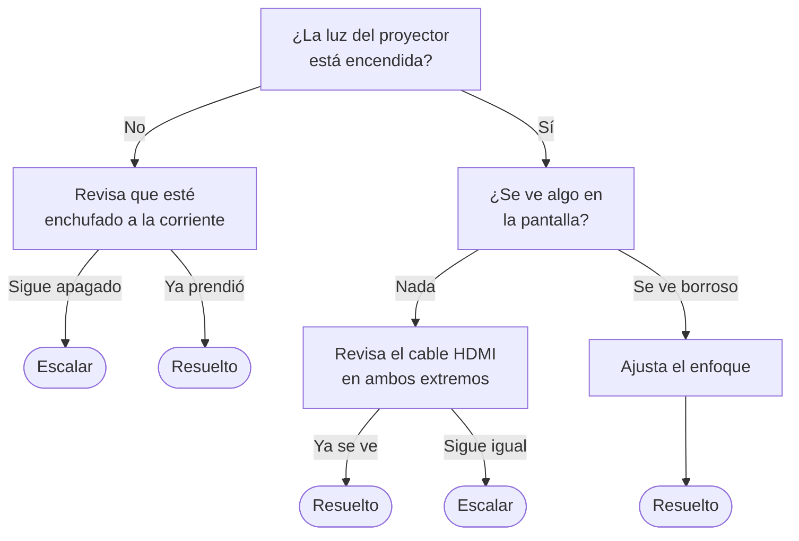
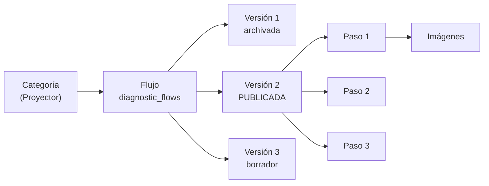

# 09 · Diagnóstico guiado

> **Qué encuentras aquí:** cómo funcionan los árboles de diagnóstico, por qué son
> deterministas, cómo se versionan y cómo se resuelven las imágenes que ve el docente.

---

## 9.1 Qué es

Un **árbol de diagnóstico** es la secuencia de pasos que el sistema le propone a un
docente para intentar resolver un tipo de problema por su cuenta, antes de llamar a nadie.

Cada categoría de problema puede tener el suyo.

---

## 9.2 La decisión de fondo: es determinista

**El modelo de lenguaje NO decide el camino.**

Lo único que hace la IA aquí es:

| Sí hace | No hace |
|---|---|
| Clasificar el texto libre de entrada para elegir **qué árbol** abrir | Decidir **qué paso** sigue |
| Reformular el texto de un paso para que se entienda mejor | Crear pasos nuevos |
| Sugerir qué imagen del catálogo mostrar | Inventar procedimientos |

Si el modelo no está disponible, **el diagnóstico funciona exactamente igual**.

### Por qué, y esto importa para la tesis

Hay dos razones, una de seguridad y una de método.

**Seguridad.** Un modelo puede generar un paso que dañe el equipo o que ponga en riesgo al
docente. «Abre la carcasa y revisa el fusible» es una frase perfectamente plausible que un
modelo puede producir, y que nadie debería ver.

**Método — y es la razón más importante.** Si cada docente recibiera un procedimiento
generado en el momento, dos docentes con el mismo problema recibirían instrucciones
distintas. Entonces el resultado del piloto **no se puede atribuir a la intervención**,
porque no hay una intervención: hay tantas intervenciones como docentes.

Con el árbol determinista, dos docentes con el mismo problema reciben el mismo
procedimiento, y la diferencia observada se puede atribuir al sistema en vez de al azar de
una generación.

---

## 9.3 Cómo está estructurado un árbol

| Nivel | Qué es |
|---|---|
| **Flujo** | Un árbol por categoría de problema |
| **Versión** | Una revisión completa del árbol. Solo una está publicada a la vez |
| **Paso** | Una pregunta, con sus opciones de respuesta y qué hacer con cada una |
| **Imágenes del paso** | Qué fotos se muestran y con qué papel |

### Un paso contiene

| Elemento | Para qué |
|---|---|
| Texto de la pregunta | Lo que lee el docente |
| Opciones de respuesta | Los botones |
| Siguiente paso por cada opción | Hacia dónde va cada respuesta |
| Desenlace terminal | Si esa rama termina en «resuelto» o en «escalar» |
| Clave de componente | Qué pieza del equipo se está mirando; sirve para resolver las imágenes |
| Imágenes asociadas | Con su papel: principal, vista alternativa o detalle |

---

## 9.4 Los cuatro desenlaces de un paso

Cuando el docente responde, el motor devuelve uno de exactamente cuatro resultados:

| Desenlace | Qué significa |
|---|---|
| **Siguiente paso** | Hay otro paso que mostrar |
| **Resuelto** | El árbol declara que aquí el problema queda resuelto |
| **Escalar** | Se acabaron los pasos conocidos: toca soporte presencial |
| **Respuesta inválida** | Lo que llegó no es una de las opciones del paso |

**Por qué exactamente cuatro y modelados como un objeto:** la alternativa habitual sería
devolver «el siguiente paso, o `null`, o `false`, o un texto». Eso obliga a quien llame a
adivinar qué significa cada valor, y las adivinanzas producen errores. Con cuatro
desenlaces explícitos, el código que los consume no puede olvidarse de uno.

---

## 9.5 Dónde vive el estado del recorrido

**No hay un puntero al paso actual.** El paso en el que está el docente se **calcula**
recorriendo las respuestas que ya dio.

**Por qué:** así el estado del recorrido vive en un solo sitio —las respuestas— y no puede
desincronizarse de él. Con un puntero guardado aparte, cualquier fallo a mitad dejaría el
puntero apuntando a un paso que no corresponde a las respuestas registradas, y no habría
forma de saber cuál de los dos está bien.

---

## 9.6 El límite de pasos

Hay un tope duro de pasos por recorrido, configurable y con un máximo absoluto en código.

**Por qué existe:** un árbol mal construido puede tener un ciclo. Sin el tope, el docente
quedaría dando vueltas indefinidamente. Con él, el recorrido termina y escala.

---

## 9.7 Las imágenes

«Revisa el cable HDMI» no significa nada para quien no sabe cuál es. La foto sí.

### Los tres papeles de una imagen

| Papel | Qué es |
|---|---|
| **Principal** | La foto que se muestra por defecto |
| **Vista alternativa** | El mismo componente desde otro ángulo o en otro modelo de equipo |
| **Detalle / referencia** | Una foto de la pieza aislada, para consultar aparte |

### La cascada de resolución

Cuando hay que mostrar una imagen para un paso, el sistema busca en este orden:

1. Una imagen asignada explícitamente a ese paso.
2. Si no hay, la imagen de referencia del **componente** que menciona el paso.
3. Si no hay, no se muestra imagen — pero el paso funciona igual.

**Por qué la cascada:** permite subir una sola foto de «cable HDMI» y que sirva en todos
los pasos que hablan de un cable HDMI, en vez de tener que asignarla paso por paso.

### Presupuesto de peso

Las imágenes se reprocesan a un máximo de **800 píxeles de ancho** y **150 KB**, en
formato WebP.

**Por qué tan estricto:** se sirve a un celular en un aula, de pie, con una clase
esperando y posiblemente con mala señal. Excederse aquí penaliza en el peor momento
posible.

Además se **eliminan los metadatos EXIF**, que pueden incluir la ubicación donde se tomó
la foto y el modelo del teléfono.

---

## 9.8 Versionado

Solo una versión está **publicada** a la vez. Las anteriores quedan archivadas.

### Por qué se versiona

Si soporte corrige el paso 3 en agosto, las incidencias atendidas en marzo tienen que
seguir siendo interpretables contra la versión que se les mostró **realmente**.

Sin versionado, el análisis de «¿el diagnóstico ayudó?» compararía respuestas dadas a
preguntas distintas, y el resultado no significaría nada.

### Qué guarda cada respuesta del docente

| Dato | Para qué |
|---|---|
| Qué paso era | Reconstruir el recorrido |
| Qué respondió | Analizar dónde se atasca la gente |
| Cuándo | Medir el tiempo por paso |
| **Qué imágenes se le mostraron** | Responder si las imágenes ayudan |

Ese último dato es lo que permite una pregunta concreta de la investigación: **¿los pasos
con imagen se resuelven más que los que no la tienen?** Sin registrarlo, la pregunta no se
puede contestar.

---

## 9.9 Cuando no hay árbol cargado

Es un caso **normal**, no un error.

Mientras soporte no haya cargado los procedimientos, el sistema lo dice honestamente y
ofrece reportar directamente al técnico.

**Por qué es preferible a inventar pasos:** un procedimiento generado por el modelo sería
plausible y no verificado. Es mejor decir «todavía no tenemos un procedimiento para esto»
que dar instrucciones que nadie revisó.

---

## 9.10 Qué se le entrega a soporte al escalar

Cuando el docente escala tras intentar el diagnóstico, el ticket llega con **el recorrido
completo**: qué pasos se le mostraron, qué respondió a cada uno y en qué orden.

**Para qué sirve:** para que el técnico no repita lo que el docente ya hizo. Es la
diferencia entre llegar y preguntar «¿ya revisaste el cable?» —lo que el docente
interpreta, con razón, como que no lo escucharon— y llegar sabiendo que el cable ya está
descartado.

---

## 9.11 Cómo se construye un árbol

Se hace desde el panel, sin programar, con permiso `diagnostics.manage`.

| Paso | Qué se hace |
|---|---|
| 1 | Crear el flujo para una categoría |
| 2 | Crear una versión en borrador |
| 3 | Añadir los pasos, con sus opciones y sus destinos |
| 4 | Asociar imágenes a los pasos |
| 5 | Publicar la versión |

### Recomendaciones para escribir buenos pasos

| Recomendación | Por qué |
|---|---|
| Una sola acción por paso | El docente está de pie con una clase esperando |
| Preguntas cerradas, no abiertas | Los botones se pulsan; el texto libre se abandona |
| Sin vocabulario técnico | «El cable grueso que va del proyector a la computadora», no «el conector HDMI tipo A» |
| Máximo seis u ocho pasos por rama | Más largo que eso, la gente escala igual pero enfadada |
| Toda rama termina en «resuelto» o «escalar» | Un paso sin salida deja al docente atrapado |
| Foto en todo paso que mencione una pieza | Es lo que más diferencia hace |

La guía práctica está en [`docs/carga-de-datos.md`](../carga-de-datos.md).
