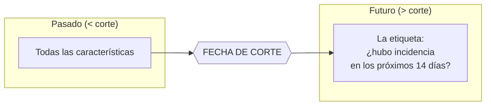
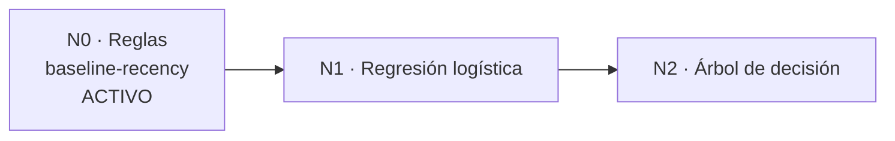

# 10 · Modelo predictivo de riesgo

> **Qué encuentras aquí:** cómo se calcula la señal de riesgo por aula, exactamente qué
> significa y qué no significa ese número, y cómo está preparado el sistema para pasar a
> un modelo supervisado cuando haya datos.

---

## 10.1 Qué es y qué NO es este número

**Léase antes de citarlo en el informe.**

El score de riesgo **no es una probabilidad**. Nadie lo ha calibrado contra datos
observados, porque durante el piloto no habrá volumen suficiente para hacerlo.

Es un **ordenamiento**. Sirve para responder:

> ✅ «¿Qué aulas conviene revisar primero?»

Y **no** sirve para responder:

> ❌ «Esta aula tiene un 78 % de probabilidad de fallar.»

Presentarlo como lo segundo sería inventar precisión que no se tiene. La interfaz del
panel lo dice explícitamente debajo de cada score: *«Ordena por dónde revisar. No es una
probabilidad de avería.»*

### Por qué aun así vale la pena

| Motivo |
|---|
| Está disponible **desde la primera incidencia registrada**, sin esperar a acumular datos |
| Cada término se explica en una frase que un técnico entiende |
| Da la **línea base** contra la que habrá que comparar cualquier modelo supervisado futuro |

Y una consecuencia de lo anterior que está declarada por adelantado: **un modelo que no
supere a esta línea base no se adopta**.

---

## 10.2 Las características que se miden

Para cada aula (y para cada par aula + categoría con historial), se construye un vector
de características a una **fecha de corte**:

| Característica | Qué es |
|---|---|
| Incidencias en 7 días | Conteo en la última semana antes del corte |
| Incidencias en 30 días | Conteo en el último mes |
| Incidencias en 90 días | Conteo en el último trimestre |
| Incidencias totales | Todo el historial previo al corte |
| Días desde la última | `null` si nunca hubo una antes del corte |
| Razón de tendencia | Últimos 30 días ÷ los 30 anteriores. `null` si no hay periodo con el que comparar |
| Días desde el mantenimiento | `null` si no hay ningún registro |
| Criticidad del aula | 1 a 4 |
| Número de equipos | Cuántos equipos tiene el aula |
| Ratio de resolución autónoma | Qué proporción se resolvió sin visita |

**Los `null` son informativos, no fallos.** «Nunca hubo una incidencia antes del corte» y
«hubo una hace 500 días» son estados distintos, y confundirlos con un cero produciría un
modelo que aprende algo falso.

---

## 10.3 La prevención de fuga temporal

Este es el punto crítico de todo el módulo, y el que más afecta a que el trabajo sea
defendible.

### Qué es la fuga temporal

Ocurre cuando el modelo se entrena con información que, en el momento de la predicción,
todavía no existía. El resultado es que **las métricas salen infladas** y el trabajo entero
deja de valer.

Es el error más común y más descalificante en un trabajo de esta clase.

### Cómo se previene aquí

Tres medidas concretas:

1. **Toda consulta de características filtra por `< corte`.** Ninguna característica puede
   mirar ni un solo día más allá.

2. **La etiqueta vive en un método aparte**, que es el único que mira hacia adelante.
   Nunca se llama desde la construcción de las características. Separarlos permite que
   exista una prueba automática que verifique que las características **no cambian** aunque
   se inventen incidencias después del corte — y esa prueba es lo que sostiene la
   afirmación.

3. **El corte se interpreta como instante, no como día.** Se usa `<` estricto, no `<=`,
   para que una incidencia ocurrida exactamente en el corte quede del lado del futuro,
   nunca del pasado.

### Está protegido por pruebas

Hay una suite completa (`tests/Risk/FeatureLeakageTest`) dedicada exclusivamente a esto:

| Prueba | Qué verifica |
|---|---|
| Ignora lo posterior al corte | Inventar incidencias después del corte no cambia ninguna característica |
| El corte es un instante | Una incidencia exactamente en el corte cuenta como futuro |
| La etiqueta sí mira adelante | Y solo dentro del horizonte declarado |
| Las ventanas tienen los límites correctos | 7, 30 y 90 días exactos |
| No cuenta borradores | Un borrador abandonado no es una incidencia |

---

## 10.4 El modelo actual: línea base explicable

El modelo activo se llama `baseline-recency`, versión 1.0. Es una **suma de términos
acotados**.

### Los seis términos

| # | Término | Contribución | Tope | Por qué |
|---|---|---|---|---|
| 1 | Incidencias en 30 días | 0,10 × cantidad | 0,40 | El de más peso: un aula que falla a menudo es el mejor predictor disponible de que volverá a fallar |
| 2 | Concentradas en 7 días | 0,08 × cantidad | 0,25 | Tres fallos esta semana no significan lo mismo que tres repartidos en un mes |
| 3 | Frecuencia en aumento | 0,05 × (razón − 1) | 0,15 | Solo cuenta si la razón supera 1,5: una variación pequeña entre dos periodos cortos es ruido, no tendencia |
| 4 | Incidencia muy reciente | 0,10 / 0,06 / 0,03 según sea ≤3, ≤7 o ≤14 días | — | Independiente del conteo: una sola incidencia anteayer dice más sobre el estado actual que cinco hace dos meses |
| 5 | Mantenimiento | 0,05 | — | Si no hay registro, o si el último es de hace más de 90 días |
| 6 | Aula de uso crítico | 0,05 si criticidad ≥3; 0,02 si es 2 | — | No predice averías: **pondera consecuencias**. Un auditorio y un aula pequeña con la misma señal no merecen la misma urgencia |

El total se acota en 1,0.

### Por qué una suma y no un producto o una exponencial

Porque **la contribución de cada término es directamente el número que se le muestra al
técnico**. No hay que derivar nada ni repartir atribuciones entre términos: cada uno
aporta lo que aporta y se puede leer tal cual.

El tope de cada término evita que una sola señal —típicamente un aula con muchas
incidencias antiguas— sature el score por sí sola.

### Los pesos son juicio de ingeniería, no ajuste estadístico

Y se declaran como tales. Cambiarlos obliga a **subir la versión del modelo**: dos números
calculados con pesos distintos no son comparables entre sí, y si se guardaran bajo la
misma versión, la serie histórica dejaría de significar nada.

---

## 10.5 Explicabilidad

**Nunca se produce un score sin factores que lo expliquen.** Hay una prueba automática que
lo verifica, y otra que comprueba que **la suma de las contribuciones coincide con el
score**.

### Cuando no hay ninguna señal

El riesgo no es «desconocido»: es **bajo, y se dice por qué**. El sistema devuelve un
factor que dice «Sin incidencias registradas — no hay historial previo a la fecha de
cálculo».

**Por qué importa:** una tarjeta vacía se lee como un fallo del sistema. El técnico
concluye que la herramienta no funciona, y deja de mirarla.

### Cómo se presenta

| Elemento | Ejemplo |
|---|---|
| El número | 0,53 |
| La banda | Medio |
| Los factores | · Incidencias en los últimos 30 días — 4 incidencias · Concentradas en los últimos 7 días — 2 incidencias · Incidencia muy reciente — hace 2 días |
| La advertencia | «Ordena por dónde revisar. No es una probabilidad de avería.» |

---

## 10.6 Las bandas

| Banda | Rango | Significado operativo |
|---|---|---|
| Bajo | < 0,33 | Sin señales relevantes |
| Medio | 0,33 – 0,66 | Conviene mirarla |
| Alto | ≥ 0,66 | Revisar con prioridad |

Los cortes son configurables.

---

## 10.7 Cómo y cuándo se calcula

Una tarea programada corre **a las 3:00 de la madrugada** y calcula:

- un score por cada **aula activa**,
- un score por cada par **aula + categoría** con historial reciente.

No genera pares para categorías sin historial: un score de un par que nunca ocurrió sería
ruido en la lista.

### Los scores se acumulan, no se sobrescriben

Cada cálculo añade una fila nueva con su fecha.

**Por qué:** para poder responder «¿el riesgo de esta aula subió?» y, sobre todo, para
poder **evaluar después si el modelo acertaba**. Si se sobrescribiera, no habría con qué
comparar y la evaluación del modelo sería imposible.

---

## 10.8 El camino hacia un modelo supervisado

El sistema está preparado para pasar de reglas a aprendizaje automático, pero **solo
cuando haya datos suficientes**, y los umbrales están declarados **por adelantado**.

### Los tres niveles previstos

| Nivel | Modelo | Se activa con | Estado |
|---|---|---|---|
| **N0** | Reglas explicables | Desde la primera incidencia | **Activo** |
| **N1** | Regresión logística | 200 observaciones y 40 positivos | Pendiente de datos |
| **N2** | Árbol de decisión | 500 observaciones y 100 positivos | Pendiente de datos |

### Por qué los umbrales se declaran por adelantado

Para **no elegir el modelo después de ver qué métrica salió mejor**.

Si se decidiera a posteriori —«probamos los tres y nos quedamos con el que dio mejor
número»— el resultado estaría sobreajustado a los datos del piloto y no diría nada sobre
el comportamiento futuro. Declarar el umbral antes convierte la elección en una regla, no
en una preferencia.

### La etiqueta supervisada

Ya está implementada y probada: **¿hubo al menos una incidencia en el aula durante los 14
días siguientes al corte?**

El horizonte de 14 días es configurable. Se eligió porque es el plazo en el que una acción
de mantenimiento preventivo todavía tiene sentido: predecir a seis meses no cambiaría
ninguna decisión operativa.

---

## 10.9 Exportación para análisis externo

El vector de características tiene una representación plana que se guarda junto al score y
se puede exportar.

**Para qué:** para poder hacer el análisis estadístico en R, Python o SPSS, que es donde
se va a hacer la parte cuantitativa de la tesis. El sistema produce el conjunto de datos;
el análisis se hace fuera.

---

## 10.10 Límites declarados

| Límite | Consecuencia |
|---|---|
| No es una probabilidad calibrada | No se puede afirmar «X % de probabilidad» |
| Los pesos son juicio, no ajuste | Otro conjunto de pesos daría otro orden |
| Depende de que se registren las incidencias | Un aula donde nadie reporta parece sana |
| El registro de mantenimiento es el dato más incompleto | Por eso su contribución es deliberadamente pequeña: no se debe penalizar a un aula por una laguna del inventario |
| Durante el piloto no habrá volumen para calibrar | Está asumido y declarado desde el diseño |

---

## 10.11 Resumen para citar en la tesis

> El módulo predictivo implementa un modelo de línea base explicable por reglas, concebido
> como ordenamiento de prioridad de inspección y no como estimador de probabilidad
> calibrado. La construcción del vector de características aplica un corte temporal
> estricto: toda característica se calcula exclusivamente sobre información anterior al
> instante de corte, y la etiqueta supervisada se obtiene en un procedimiento separado que
> es el único con acceso a la ventana posterior. Esta separación está verificada por
> pruebas automáticas que comprueban la invariancia de las características ante la
> inserción de observaciones posteriores al corte. Los umbrales de activación de modelos
> supervisados (regresión logística y árbol de decisión) se declararon con anterioridad a
> la recolección de datos, y se establece como criterio de adopción que todo modelo
> candidato debe superar el desempeño de la línea base.
