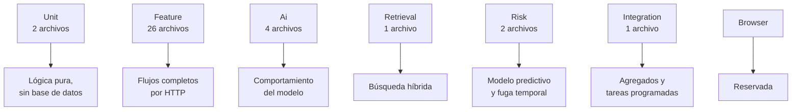
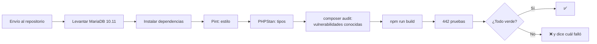

# 12 · Pruebas y calidad del código

> **Qué encuentras aquí:** cómo está probado el sistema, qué se prueba en cada suite, qué
> herramientas de calidad se aplican y cómo funciona la integración continua.

---

## 12.1 Los números

| Métrica | Valor |
|---|---|
| Pruebas automáticas | **442** |
| Aserciones | 1 171 |
| Archivos de prueba | 36 |
| Suites | 7 |
| Duración de la suite completa | ~5 minutos |
| Nivel de PHPStan | 5, sin errores |
| Estilo de código | Laravel Pint, sin desviaciones |

---

## 12.2 Las siete suites, y por qué están separadas



**Por qué separadas y no todas juntas:** porque cada una responde una pregunta distinta y
se ejecuta en momentos distintos. Durante el desarrollo se corre solo la suite afectada;
la completa se corre antes de subir cambios.

---

## 12.3 Qué prueba cada suite

### Unit — la lógica que no toca nada

| Archivo | Qué verifica |
|---|---|
| `IncidentStateMachineTest` | Que las transiciones inválidas se rechacen y las válidas se acepten |
| `TextNormalizerTest` | Que comparar palabras dé el mismo resultado en cualquier máquina. Ver 12.5 |

Es la única suite que corre sin base de datos, y por eso es instantánea.

### Feature — los flujos completos

Veintiséis archivos. Los más significativos:

| Archivo | Qué verifica |
|---|---|
| `EndToEndFlowTest` | El recorrido completo del docente: del QR al ticket |
| `TeacherLocationFlowTest` | La cascada de ubicación |
| `TeacherReportFlowTest` | Clasificación, diagnóstico y escalamiento |
| `AbuseGuardTest` | Los seis controles antiabuso, uno por uno |
| `SecurityHardeningTest` | Que las cabeceras de seguridad estén presentes y sean correctas |
| `SupportPanelTest` | El panel completo y sus permisos |
| `TrackingAndHistoryTest` | Seguimiento del docente, foto e historial del aula |
| `ReportsAndArticleTest` | Reportes y conversión de solución en artículo |
| `DemoDataLifecycleTest` | Que los datos de demostración se creen marcados y se borren por completo |
| `CatalogImportTest` | Que la importación previsualice antes de escribir |
| `KnowledgeIngestionTest` | Que un documento se extraiga, fragmente e indexe |
| `AuthenticationTest`, `UserManagementTest`, `AuditViewsTest` | Identidad y trazabilidad |

### Ai — el comportamiento del modelo

Esta suite es específica del proyecto y merece explicación.

| Archivo | Qué verifica |
|---|---|
| `PeruvianVocabularyTest` | Que «cañón» se clasifique como proyector, «compu» como computadora, «no jala» como avería |
| `HallucinationGuardTest` | Que el verificador de anclaje rechace respuestas no sustentadas |
| `HallucinationProbesTest` | Sondas deliberadas: preguntas cuya respuesta correcta es **«no lo sé»** |
| `TeacherAssistantTest` | El flujo completo de pregunta y respuesta |

**Las sondas de alucinación son lo más valioso de esta suite.** Son preguntas construidas
para que el sistema no tenga respaldo, y la prueba verifica que **no responda**. Un
sistema que pasa las pruebas normales pero falla estas es un sistema que inventa.

El glosario peruano también está protegido: si alguien recorta esa lista del prompt, las
pruebas fallan y dicen por qué.

### Retrieval — la búsqueda

| Qué verifica |
|---|
| Que la búsqueda léxica encuentre términos exactos |
| Que la semántica encuentre paráfrasis |
| Que la salvaguarda del prefiltro se active cuando corresponde |
| Que los fragmentos de otro modelo de vectores se descarten |
| Que la fusión ordene correctamente |

### Risk — el modelo predictivo

| Archivo | Qué verifica |
|---|---|
| `FeatureLeakageTest` | **La ausencia de fuga temporal.** Ver abajo |
| `RiskEngineTest` | Que nunca haya score sin factores, que las contribuciones sumen el score, que el modelo sea monótono |

### Integration — agregados y tareas

| Qué verifica |
|---|
| Que los agregados diarios se calculen bien y no revienten sin datos |

---

## 12.4 La suite que sostiene la validez del trabajo

`FeatureLeakageTest` merece sección propia porque es la que hace defendible el módulo
predictivo.

| Prueba | Qué demuestra |
|---|---|
| «Ignora por completo lo ocurrido después de la fecha de corte» | Inventar incidencias posteriores al corte **no cambia ninguna característica** |
| «Trata el corte como instante» | Una incidencia exactamente en el corte cuenta como futuro |
| «La etiqueta sí mira hacia adelante, y solo dentro del horizonte» | La separación funciona en las dos direcciones |
| «Cuenta las ventanas de 7, 30 y 90 días con los límites correctos» | Los conteos son exactos |
| «No cuenta los borradores abandonados» | Un abandono no infla el historial |
| «Devuelve null cuando no hay periodo anterior con el que comparar» | Los `null` son informativos, no ceros disfrazados |

**Sin estas pruebas, la afirmación «no hay fuga temporal» sería una declaración de
intenciones.** Con ellas, es una propiedad verificada en cada ejecución.

---

## 12.5 Cómo están escritas las pruebas

### En español, describiendo comportamiento

Los nombres de las pruebas se leen como frases:

> *«el docente ve el estado de su solicitud sin cuenta ni contraseña»*
> *«no permite dos artículos del mismo ticket»*
> *«avisa cuando hay tan pocos casos que no se puede concluir nada»*

**Por qué:** cuando una prueba falla, el nombre tiene que decir qué se rompió sin abrir el
archivo. Un nombre como `testCase17` no dice nada.

### Con el porqué escrito dentro

Cada prueba lleva un comentario que explica **por qué** ese comportamiento importa, no qué
hace el código. Por ejemplo, junto a la prueba de que no se muestra el nombre del técnico:

> *«El nombre NO: el docente necesita saber que alguien se hizo cargo, no a quién buscar
> por WhatsApp saltándose el canal que se mide.»*

Eso convierte la suite en documentación viva de las decisiones de diseño.

### Sin depender de servicios externos

Las pruebas **no necesitan Ollama**. Usan el proveedor de mentira, que responde de forma
predecible. Eso es lo que permite que corran en GitHub, donde no hay ni GPU ni 6 GB para un
modelo.

---

## 12.6 La base de datos de prueba

Las pruebas corren contra **MariaDB real**, no contra SQLite.

### Por qué, aunque SQLite sería mucho más rápido

Porque la suite depende de tres cosas que SQLite no tiene:

| Dependencia | Dónde se usa |
|---|---|
| Índice de texto completo en modo booleano | Toda la búsqueda léxica |
| Tipos enumerados | Estados de equipo, tipos de resolución |
| Claves foráneas con restricción real | La protección contra borrados destructivos |

Con SQLite, las pruebas pasarían y el sistema fallaría en producción — que es el peor
resultado posible de una suite de pruebas.

Se usa una base separada (`incidencias_test`) que se limpia entre pruebas.

---

## 12.7 Análisis estático

**PHPStan a nivel 5**, sin errores y sin excepciones silenciadas.

### Qué detecta que las pruebas no

| Problema | Ejemplo |
|---|---|
| Tipos incompatibles | Pasar un texto donde se espera un número |
| Métodos que no existen | Una llamada a algo que se renombró |
| Propiedades que podrían ser nulas | Acceder a `$incident->room->code` sin comprobar |
| Código inalcanzable | Una rama que nunca se ejecuta |

### La regla que se sigue

Cuando PHPStan señala un error, **se arregla la causa**. No se silencia con anotaciones, no
se añaden conversiones de tipo para callarlo, y no se amplían tipos para que deje de
quejarse. Un error suprimido es un error que sigue ahí.

---

## 12.8 Estilo de código

**Laravel Pint**, con la configuración estándar del framework.

No es una cuestión estética: un estilo uniforme hace que las diferencias entre versiones
muestren cambios reales y no reformateos, y elimina una categoría entera de discusiones
que no aportan nada.

---

## 12.9 Integración continua

Cada envío al repositorio dispara la verificación automática en GitHub Actions.



### Detalles de la configuración

| Detalle | Valor | Por qué |
|---|---|---|
| Base de datos | MariaDB 10.11 como servicio, no SQLite | Mismo motivo que en local |
| Proveedor de IA | `null` | No hay Ollama en un servidor de integración |
| `composer audit` | Activado | Avisa de dependencias con vulnerabilidades publicadas |
| Compilación del frontend | Incluida | Un error de CSS o de JavaScript rompe la compilación y hay que verlo |

### Lo primero que encontró, y es el mejor argumento a su favor

En su primera ejecución, la integración continua detectó un defecto que **436 pruebas en
verde sobre Windows no habían visto**: el clasificador comparaba texto con una función que
depende de la codificación configurada en PHP, sin fijarla explícitamente.

En XAMPP sobre Windows esa configuración era UTF-8 y todo funcionaba. En el Linux del
servidor de integración no, y «cañon» dejaba de coincidir con «cañon». El síntoma era
absurdo: la misma frase clasificaba como **proyector** en una máquina y como
**computadora** en otra, sin que nada fallara visiblemente.

Es exactamente la clase de defecto que no aparece hasta que el sistema se mueve de
computadora — es decir, hasta el día en que se instala en la universidad.

El arreglo fue extraer la normalización a una clase compartida que fija la codificación y
además pliega tildes y eñes, porque en un aula nadie escribe con tildes y «cañón»,
«cañon» y «canon» son la misma palabra dicha por tres docentes distintos. Queda protegido
por `TextNormalizerTest`, que incluye una prueba que cambia deliberadamente la
codificación interna de PHP para comprobar que el resultado no varía.

### Para qué sirve de verdad

Para que **el estado del proyecto sea verificable por alguien que no lo ejecutó**. El
profesor, el jurado o un colaborador ven en GitHub una marca verde que significa: en esta
versión concreta del código, las 442 pruebas pasaban, el análisis estático estaba limpio y
el proyecto compilaba.

Eso es una afirmación mucho más fuerte que «a mí me funciona».

---

## 12.10 Qué NO está probado

Declararlo es parte del trabajo:

| No probado | Por qué | Riesgo |
|---|---|---|
| **La interfaz en navegadores reales** | La carpeta `tests/Browser` está reservada pero vacía | Un fallo visual no lo detecta ninguna prueba |
| **El comportamiento con el modelo real** | Las pruebas usan el proveedor de mentira | Un cambio de modelo podría degradar la clasificación sin que nada avise |
| **Carga y concurrencia** | No hay pruebas de estrés | Se desconoce el comportamiento con muchos usuarios simultáneos |
| **Accesibilidad** | No hay verificación automatizada | Podría haber problemas para usuarios con lectores de pantalla |
| **Compatibilidad entre navegadores** | Solo se comprobó manualmente | |

De estos, el que más conviene cubrir en Taller de Investigación 2 es el segundo: un
conjunto de casos etiquetados contra el modelo real, que además serviría para calibrar los
umbrales de confianza. Ver [16 · Mejoras futuras](16-mejoras-futuras.md).

---

## 12.11 Cómo ejecutar las pruebas

Todas:

```bash
php artisan test
```

Solo una suite:

```bash
php artisan test --testsuite=Risk
```

Solo un archivo:

```bash
php artisan test --filter=FeatureLeakageTest
```

Estilo y análisis estático:

```bash
./vendor/bin/pint
```

```bash
./vendor/bin/phpstan analyse
```
