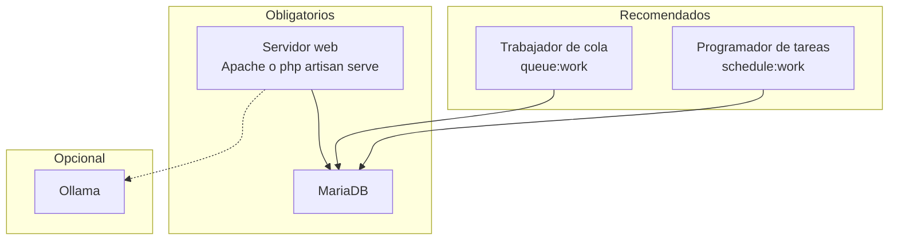

# 13 · Operación del sistema

> **Qué encuentras aquí:** cómo se pone en marcha, qué procesos tiene que estar corriendo,
> qué tareas se ejecutan solas, cómo se comprueba que está sano y qué hacer cuando algo
> falla.

---

## 13.1 Los procesos que componen el sistema



| Proceso | ¿Obligatorio? | Qué pasa si no está |
|---|---|---|
| Servidor web | **Sí** | No hay sistema |
| MariaDB | **Sí** | No hay sistema |
| Trabajador de cola | Recomendado | Los documentos subidos no se indexan nunca |
| Programador de tareas | Recomendado | No se purgan borradores, no se calculan riesgos ni agregados |
| Ollama | Opcional | El sistema funciona en modo determinista |

---

## 13.2 Puesta en marcha

La guía completa paso a paso, con lo que tiene que salir en pantalla en cada punto, está
en [`docs/instalar-en-otra-pc.md`](../instalar-en-otra-pc.md).

Resumen de la secuencia:

| # | Qué |
|---|---|
| 1 | XAMPP con PHP 8.2, en `C:\xampp` |
| 2 | Composer y Node.js (LTS) |
| 3 | Crear `incidencias` e `incidencias_test` con cotejamiento `utf8mb4_unicode_ci` |
| 4 | Copiar `.env.example` a `.env`, instalar dependencias, generar la clave |
| 5 | `php artisan migrate --seed` y `npm run build` |
| 6 | `php artisan serve` |
| 7 | Ollama con los dos modelos (opcional) |
| 8 | `php artisan test` — tiene que decir 436 |
| 9 | `php artisan demo:purge --force` antes de cargar datos reales |

### La trampa que más tiempo hace perder

> **La carpeta del proyecto no puede tener tildes ni eñes en la ruta.**

`C:\proyectos\incidencias` funciona. Una ruta con «Investigación» dentro produce errores
que apuntan a archivos que sí existen, y se pierden horas buscando el problema donde no
está.

### Lo que nunca hay que copiar entre computadoras

`vendor/` · `node_modules/` · `.env`

Las tres se generan en cada máquina. Copiarlas de otra es la causa número uno de errores
inexplicables.

---

## 13.3 Comandos propios del sistema

| Comando | Qué hace | Cuándo se ejecuta |
|---|---|---|
| `piloto:sembrar` | Purga los datos de demostración y siembra la estructura aproximada del piloto | A mano, al preparar el entorno |
| `demo:purge --force` | Elimina **todos** los datos de demostración | A mano, antes de cargar datos reales |
| `incidents:purge-drafts` | Borra los borradores abandonados | Automático, cada hora |
| `metrics:snapshot` | Recalcula los agregados diarios | Automático, 2:30 |
| `risk:compute` | Calcula las señales de riesgo | Automático, 3:00 |

### Por qué `demo:purge` exige `--force`

Antes preguntaba de forma interactiva. Se cambió por dos motivos:

1. **Una pregunta interactiva se responde con Enter sin leerla.** Es más seguro exigir que
   se escriba el parámetro.
2. La versión interactiva **fallaba** al ejecutarse en ciertos entornos de Windows,
   produciendo un error que parecía otra cosa completamente distinta.

---

## 13.4 Tareas programadas

| Hora | Tarea | Por qué a esa hora |
|---|---|---|
| Cada hora | Purgar borradores abandonados | Los borradores se acumulan durante el día |
| 02:30 | Agregados de métricas | Antes del cálculo de riesgo, que los usa |
| 03:00 | Cálculo de riesgo | De madrugada, sin usuarios y sin competir por recursos |

### Cómo se activan

En desarrollo:

```bash
php artisan schedule:work
```

En una instalación permanente, se configura una tarea del sistema operativo que ejecute
cada minuto:

```bash
php artisan schedule:run
```

**Si nadie ejecuta ninguna de las dos, las tareas no corren.** Es la causa más común de
«el riesgo no se actualiza».

---

## 13.5 La cola de trabajos

Se usa para la indexación de documentos, que puede tardar minutos.

```bash
php artisan queue:work
```

### Qué pasa si no está corriendo

Los documentos subidos se quedan en estado «pendiente» y **nunca se indexan**. El
asistente no los encuentra. No hay error visible, solo silencio — que es el peor tipo de
fallo.

Por eso el estado del sistema informa de los trabajos pendientes y fallidos.

### La política de reintento

Un reintento. Si falla dos veces seguidas, el problema es el documento o el entorno, no la
mala suerte, y se registra el error para que alguien lo mire en lugar de reintentar
indefinidamente.

---

## 13.6 Comprobación de salud

Hay una dirección `/salud` que devuelve el estado del sistema en formato legible por
máquina.

### Qué comprueba

| Componente | ¿Degrada el estado global? |
|---|---|
| Base de datos | **Sí** |
| Cola de trabajos | No, pero informa |
| Modelo de lenguaje | **No** |
| Almacenamiento | No, pero informa |

### La decisión que hace útil este endpoint

**Ollama no degrada el estado.** Es deliberado y coherente con toda la arquitectura: sin
modelo, el sistema sigue funcionando completo en modo determinista.

Marcarlo como caído haría sonar una alarma a las tres de la mañana por algo que **no
impide a ningún docente reportar nada**. Y una alarma que suena sin motivo se acaba
silenciando — justo antes de la vez que sí importaba.

Los trabajos fallidos tampoco tumban el estado, pero se informan: significan documentos sin
indexar o avisos sin entregar, que es una degradación real que alguien debe mirar sin
prisa.

### No revela nada de la instalación

El endpoint **no requiere autenticación**, y por eso no expone versiones, rutas, nombres de
base de datos ni mensajes de error.

Un endpoint de salud que describe la instalación es un regalo para quien la está
explorando.

---

## 13.7 Configuración

Toda la configuración del comportamiento vive en `config/incidencias.php`, y los valores
concretos en el archivo `.env`.

### Las variables que más se tocan

| Variable | Para qué |
|---|---|
| `LLM_PROVIDER` | `ollama` o `null` |
| `LLM_MODEL` | Qué modelo usar |
| `EMBEDDING_MODEL` | Modelo de vectores |
| `ASSISTANT_CONFIDENCE_HIGH` / `_LOW` | Umbrales de confianza. **Vacíos hoy, a propósito** |
| `ABUSE_*` | Los umbrales antiabuso |
| `RISK_HORIZON_DAYS` | Horizonte de predicción |
| `APP_DISPLAY_TIMEZONE` | Hora de presentación (Lima) |
| `ALLOW_DEMO_SEED` | Permite crear datos de demostración |

### Después de tocar el `.env`

```bash
php artisan config:clear
```

Sin esto, la configuración sigue en caché y el cambio no tiene efecto. Es la segunda causa
más común de «cambié algo y no pasa nada».

---

## 13.8 Zonas horarias

| Dónde | Qué se usa |
|---|---|
| Almacenamiento | UTC |
| Presentación | Hora de Lima |

**Por qué:** guardar en hora local hace que los cálculos de duración fallen en los cambios
de horario y que los datos no se puedan comparar entre sedes. La conversión se hace al
mostrar, no al guardar.

---

## 13.9 Respaldos

Lo que hay que respaldar:

| Qué | Dónde | Por qué |
|---|---|---|
| Base de datos completa | `mysqldump` | Es todo el dato del piloto |
| Carpeta de almacenamiento | `storage/app` | Documentos e imágenes subidos |
| Archivo `.env` | Aparte, **nunca en el repositorio** | Lleva las claves |

**Lo que no hace falta respaldar:** `vendor/`, `node_modules/`, `public/build/` — se
regeneran.

### Recomendación para el piloto

Respaldo diario de la base de datos mientras dure la recolección. Perder los datos del
piloto significa perder el semestre, y no hay forma de reconstruirlos.

---

## 13.10 Qué hacer cuando algo falla

| Síntoma | Causa habitual | Solución |
|---|---|---|
| `could not find driver` | Falta la extensión de MySQL en PHP | En `php.ini`, quitar el `;` de `extension=pdo_mysql` |
| `Connection refused` | MariaDB apagado | Arrancarlo desde el panel de XAMPP |
| `Failed to open stream` en archivos que sí existen | La ruta tiene tildes | Mover el proyecto a una ruta sin tildes |
| La página se ve sin estilos | Falta compilar | `npm run build` |
| `Class not found` | Autoload desactualizado | `composer dump-autoload` |
| Cambié el `.env` y no pasa nada | Configuración en caché | `php artisan config:clear` |
| Los documentos no se indexan | La cola no está corriendo | `php artisan queue:work` |
| El riesgo no se actualiza | El programador no está corriendo | `php artisan schedule:work` |
| El asistente siempre dice «no lo sé» | No hay documentos publicados, o Ollama está apagado | Cargar y publicar documentos; comprobar `/salud` |

Detalles adicionales en
[`docs/endurecimiento-y-operacion.md`](../endurecimiento-y-operacion.md).

---

## 13.11 Lo que NO hay que hacer

| Nunca | Por qué |
|---|---|
| **Cargar datos con `INSERT` desde phpMyAdmin** | Se salta las comprobaciones del sistema y deja la base en un estado que la aplicación no sabe manejar |
| **Copiar `vendor` o `node_modules` de otra computadora** | Se generan por máquina |
| **Subir el `.env` al repositorio** | Lleva las claves |
| **Cambiar un umbral sin documentarlo** | Los datos de antes y después dejan de ser comparables |
| **Borrar registros directamente en la base** | Rompe las relaciones y deja incidencias huérfanas |
| **Ejecutar `demo:purge` después de empezar a recoger datos reales** | Sin riesgo para los datos reales, pero conviene no acostumbrarse |
