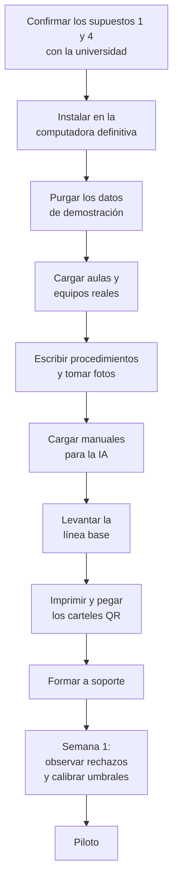

# 15 · Estado real del piloto

> **Qué encuentras aquí:** qué está probado de verdad y qué todavía no, con las cifras
> exactas de hoy. Es el documento que responde las preguntas incómodas antes de que las
> haga el jurado.
>
> **Fecha de corte de este documento: 2 de septiembre de 2026.**

---

## 15.1 Cómo leer este documento

Este documento describe **una situación transitoria**. Todo lo que aparece aquí como
«falta» se resuelve cargando información, no programando: el software ya está terminado y
verificado.

Cuando la información esté cargada y el piloto haya corrido, este documento se actualiza y
la mayoría de las advertencias desaparecen. **Hasta entonces, conviene tenerlas escritas**:
un trabajo que declara sus límites es más creíble que uno que los omite y espera que nadie
pregunte.

---

## 15.2 La separación entre software y datos

| Dimensión | Estado |
|---|---|
| **Código** | ✅ Terminado. 139 rutas, 442 pruebas en verde, análisis estático limpio |
| **Datos institucionales reales** | ⬜ Pendientes |
| **Corpus para la IA** | ⬜ Vacío |
| **Piloto ejecutado** | ⬜ No iniciado |
| **Calibración de parámetros** | ⬜ Pendiente de datos |

**El código ya no es el cuello de botella.** Lo que falta es trabajo de campo: ir a las
aulas, levantar el inventario, escribir los procedimientos y conseguir los manuales.

---

## 15.3 Qué hay hoy en la base de datos

Cifras exactas al 2 de septiembre de 2026:

| Tabla | Registros | Qué son |
|---|---|---|
| Sedes | 1 | Huancayo |
| Pabellones | 7 | C, D, E, G, H, I, J — **estructura aproximada, no verificada** |
| Pisos | 35 | 5 por pabellón — aproximados |
| Aulas | 121 | **Las 121 están marcadas como demostración** |
| Equipos | 360 | Inventados para probar |
| **Incidencias reales** | **4** | Creadas al probar el sistema |
| **Documentos para la IA** | **0** | **Ninguno** |
| **Fragmentos indexados** | **0** | Consecuencia de lo anterior |
| Árboles de diagnóstico | 2 | De prueba |
| Pasos de diagnóstico | 26 | De prueba |
| Imágenes | 6 | De prueba |
| Interacciones con el asistente | 2 | De las pruebas manuales |
| Scores de riesgo | 0 | Nunca se ha ejecutado el cálculo con datos reales |
| Encuestas respondidas | 3 | De prueba |

### La cifra que más importa

> **Cero documentos cargados.**

Mientras siga así, el asistente responde «no lo sé» a prácticamente todo. **Y hace bien:
no puede inventar.** Pero eso significa que la función más visible del sistema no se puede
demostrar todavía.

Es también la más fácil de resolver: subir manuales y procedimientos por el panel, y el
sistema los indexa solo.

---

## 15.4 Lo que está verificado

No todo es incertidumbre. Esto sí está comprobado:

| Verificado | Cómo |
|---|---|
| El flujo completo del docente funciona | Prueba de extremo a extremo, más comprobación manual en navegador |
| El modelo clasifica vocabulario peruano | 10 de 10 en los casos de prueba, contra el modelo real |
| El asistente no inventa | Sondas de alucinación: se le hacen preguntas sin respaldo y no responde |
| No hay fuga temporal en el modelo de riesgo | Suite dedicada de pruebas |
| El sistema funciona con la IA apagada | Las 442 pruebas corren sin Ollama |
| Los datos de demostración se purgan por completo | Prueba de ciclo de vida |
| Las cabeceras de seguridad son correctas | Prueba específica |
| Los permisos se respetan | Cada ruta del panel tiene su prueba de permiso |

---

## 15.5 Los ocho supuestos sin confirmar

Estos son supuestos que se tomaron para poder avanzar y que **hay que confirmar con la
universidad**. Están listados en orden de impacto si resultan falsos.

| # | Supuesto | Impacto si es falso |
|---|---|---|
| 1 | Se autoriza pegar un cartel con QR en las aulas | **Bloqueante.** Sin QR no hay canal |
| 2 | Los pabellones del piloto son C, D, E, G, H, I, J | Cambia toda la carga de datos |
| 3 | Cada pabellón tiene 5 pisos y 3–4 aulas por piso | Cambia el volumen esperado |
| 4 | Existe personal de soporte que atenderá los tickets | **Bloqueante.** Sin soporte no hay ciclo |
| 5 | Se puede instalar el sistema en una computadora de la universidad | Se resuelve con un equipo propio |
| 6 | Hay manuales de los equipos disponibles | Sin ellos hay que escribir los procedimientos desde cero |
| 7 | Los docentes tienen celular con cámara y datos | Muy probable, pero no verificado |
| 8 | La red del aula permite llegar al servidor | Depende de dónde se instale |

Los supuestos 1 y 4 son los que hay que confirmar primero: sin ellos no hay piloto.

---

## 15.6 Los parámetros sin calibrar

Varios números del sistema están deliberadamente **sin fijar**, y el sistema opera mientras
tanto en modo conservador.

| Parámetro | Estado hoy | Cómo se va a fijar |
|---|---|---|
| **Umbral de confianza alto** | Vacío → usa 0,75 | Con un conjunto de preguntas etiquetadas por soporte |
| **Umbral de confianza bajo** | Vacío → usa 0,45 | Igual |
| Ventana de duplicado (15 min) | Provisional | Observando la tabla de rechazos en la primera semana |
| Máximo activo por aula (3) | Provisional | Igual |
| Máximo por dispositivo/hora (3) | Provisional | Igual |
| Máximo por red/hora (30) | Provisional | Igual |
| Bandas de riesgo (0,33 / 0,66) | Provisional | Con la distribución real de scores |

### Por qué se dejaron vacíos en vez de poner un número

Porque **inventar un número aquí sería fingir precisión**.

Un umbral de confianza es una decisión que solo tiene sentido contra datos observados. Si
se pusiera 0,7 «porque suena razonable» y luego el sistema se comportara mal, no habría
forma de saber si el problema es el umbral, el modelo o el corpus.

Dejarlo vacío y documentar el valor conservador que se usa mientras tanto es más honesto y
más útil.

### Cuando se calibre, hay que documentarlo

Cambiar un umbral sin dejar constancia hace que **los datos de antes y después dejen de ser
comparables**. Cada ajuste debe registrar: qué se cambió, cuándo, con qué evidencia y qué
se esperaba conseguir.

---

## 15.7 Lo que no existe todavía

| Falta | Para qué haría falta | Prioridad |
|---|---|---|
| **Conjunto de preguntas etiquetado** | Calibrar los umbrales de confianza y medir el acierto del asistente | Alta |
| **Línea base pre-sistema** | Poder afirmar que el sistema mejoró algo | **Crítica** |
| **Procedimientos institucionales reales** | Que el diagnóstico sirva | Alta |
| **Inventario real de equipos** | Que el técnico sepa a qué va | Alta |
| **Fotos de los equipos reales** | Que el diagnóstico se entienda | Alta |
| **Aprobación ética / institucional** | Recoger datos de personas | Depende de la universidad |

### La línea base es la más crítica y la más olvidada

Sin saber cuánto tardaba el proceso **antes**, la pregunta «¿el sistema redujo el tiempo de
interrupción?» no tiene respuesta posible. No hay con qué comparar.

Hay tres formas de conseguirla, en orden de calidad:

1. Registros históricos de la mesa de ayuda, si existen.
2. Una encuesta a docentes sobre cuánto tardaban y qué hacían.
3. Un periodo de observación previo al despliegue.

**Conviene resolverlo antes de encender el sistema**, porque después ya no se puede
observar el proceso anterior.

---

## 15.8 Los riesgos del piloto

| # | Riesgo | Probabilidad | Impacto | Mitigación |
|---|---|---|---|---|
| R1 | No hay volumen suficiente para el modelo predictivo | **Alta** | Medio | Ya asumido: el modelo de línea base funciona desde la primera incidencia y se declara como ordenamiento, no como predicción |
| R2 | Los docentes no usan el QR y siguen con WhatsApp | Media | **Alto** | Comunicación institucional; el sistema mide el abandono para detectarlo |
| R3 | Soporte no responde por el sistema | Media | **Alto** | Depende de un compromiso institucional, no del software |
| R4 | No hay manuales de los equipos | Media | Medio | Escribir procedimientos propios; el sistema los admite en Markdown |
| R5 | El modelo local es demasiado lento en la máquina disponible | Baja | Bajo | El sistema funciona sin él |
| R6 | Los umbrales antiabuso bloquean docentes legítimos | Media | Medio | Se observa la tabla de rechazos desde el primer día |
| R7 | La fricción del QR genérico es mayor de lo esperado | Media | Medio | Se mide explícitamente; si sale alto es un hallazgo, no un fracaso |
| R8 | Se pierden los datos del piloto | Baja | **Crítico** | Respaldo diario mientras dure la recolección |

---

## 15.9 Qué se puede afirmar hoy, y qué no

### Sí se puede afirmar

- Que existe un sistema funcional que cubre el ciclo completo de la incidencia.
- Que la arquitectura permite operar con y sin modelo de lenguaje.
- Que el asistente no inventa procedimientos, y que eso está verificado por pruebas.
- Que el módulo predictivo no incurre en fuga temporal, y que eso está verificado.
- Que el sistema está instrumentado para responder las preguntas de investigación
  planteadas.

### **No** se puede afirmar todavía

- Que el sistema reduce el tiempo de interrupción de clase. *(No hay línea base ni piloto.)*
- Que los docentes lo prefieren al canal informal. *(No se ha usado en producción.)*
- Que el asistente resuelve un porcentaje X de consultas. *(No hay corpus cargado.)*
- Que la señal de riesgo anticipa incidencias. *(No hay historial suficiente.)*
- Ninguna cifra de resultado. *(Las 4 incidencias existentes son de prueba.)*

---

## 15.10 Cómo pasar de aquí al piloto

| # | Paso | Quién |
|---|---|---|
| 1 | Confirmar autorización del QR y compromiso de soporte | Investigador + universidad |
| 2 | Instalar en la computadora definitiva | Soporte TI |
| 3 | Purgar los datos de demostración | Soporte TI |
| 4 | Cargar aulas y equipos reales | Soporte TI |
| 5 | Escribir procedimientos y tomar fotos | Soporte TI |
| 6 | Cargar manuales | Soporte TI |
| 7 | Levantar la línea base | Investigador |
| 8 | Imprimir y pegar carteles | Investigador |
| 9 | Formar a soporte en el panel | Investigador |
| 10 | Primera semana: observar y calibrar | Investigador |

---

## 15.11 Resumen para citar en la tesis

> A la fecha de este informe, el desarrollo del sistema se encuentra concluido y
> verificado: la totalidad de los casos de uso especificados está implementada y cubierta
> por 442 pruebas automatizadas, con análisis estático sin observaciones. La instancia
> operativa contiene exclusivamente datos sintéticos, marcados como tales y eliminables en
> bloque, por lo que ninguna cifra de resultado puede reportarse en esta etapa. Los
> parámetros que requieren calibración empírica —umbrales de confianza del asistente y
> umbrales de los controles antiabuso— se mantienen deliberadamente sin fijar, operando el
> sistema con valores conservadores documentados, en tanto la asignación de valores
> arbitrarios constituiría una precisión no sustentada. El trabajo pendiente para el inicio
> del piloto es de naturaleza institucional y de recolección de información, no de
> desarrollo.
